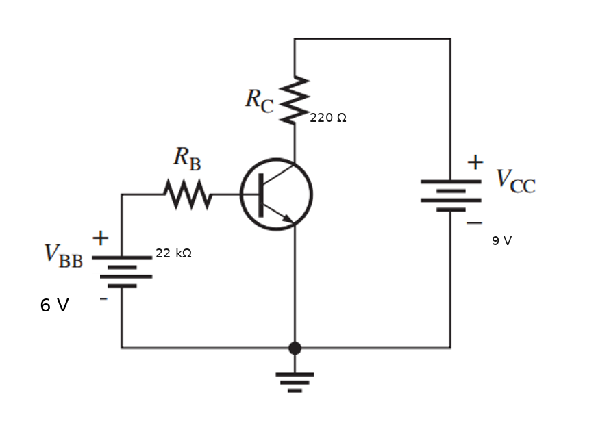
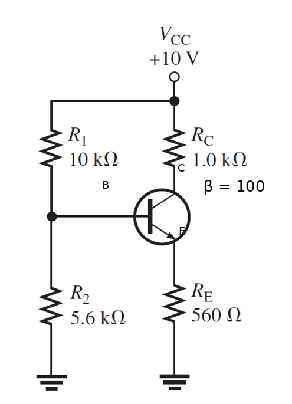
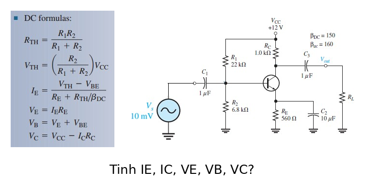
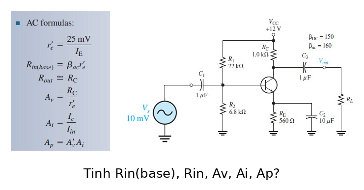
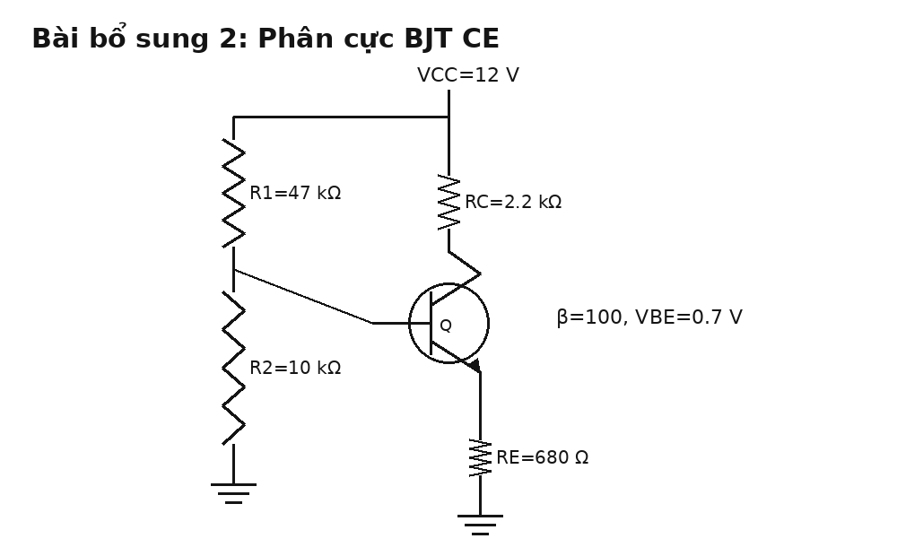

# Bài tập BJT có đáp án và lời giải chi tiết

Tài liệu này chỉ tập trung vào **BJT**. Mỗi bài đều có:

- hình mạch
- yêu cầu
- đáp số ngắn
- cơ sở công thức
- lời giải chi tiết

Bạn nên làm theo thứ tự:

1. Tự nhìn hình và phân tích mạch.
2. Tự viết công thức trước.
3. Chỉ xem phần đáp án sau khi đã làm xong.

## Bài 1. BJT phân cực base cố định

{ width=92% }

**Nguồn bài**: chọn từ [Giai_BT_Slide.md](/home/hiimfelix/Note/MĐT/bai_giai_slide/Giai_BT_Slide.md)

**Yêu cầu**

Biết $V_{BE}=0.7\,\mathrm{V}$, $\beta = 90$, $R_B = 22\,\mathrm{k}\Omega$, $R_C = 220\,\Omega$, $V_{BB}=6\,\mathrm{V}$, $V_{CC}=9\,\mathrm{V}$.

Hãy tính:

1. $I_B$, $I_C$, $I_E$
2. $V_{CE}$, $V_{CB}$
3. Kết luận transistor ở vùng nào

**Đáp số ngắn**

$$
I_B = \frac{6-0.7}{22\,\mathrm{k}\Omega} \approx 0.240\,\mathrm{mA}
$$

$$
I_C = \beta I_B \approx 21.6\,\mathrm{mA}
$$

$$
I_E = I_B + I_C \approx 21.84\,\mathrm{mA}
$$

$$
V_{CE} = 9 - 21.6\,\mathrm{mA}\cdot220\,\Omega \approx 4.25\,\mathrm{V}
$$

$$
V_{CB} = V_{CE} - V_{BE} \approx 3.55\,\mathrm{V}
$$

**Cơ sở và công thức**

- KVL vòng base:

$$
I_B = \frac{V_{BB} - V_{BE}}{R_B}
$$

- Quan hệ dòng BJT:

$$
I_C = \beta I_B,\qquad I_E = I_B + I_C
$$

- KVL vòng collector:

$$
V_{CE} = V_{CC} - I_C R_C
$$

**Lời giải chi tiết**

Vì đây là mạch phân cực base cố định, việc đầu tiên là tính dòng base từ nguồn $V_{BB}$:

$$
I_B = \frac{V_{BB} - V_{BE}}{R_B}
= \frac{6-0.7}{22\,\mathrm{k}\Omega}
\approx 0.240\,\mathrm{mA}
$$

Trong vùng active, dòng collector được xác định bởi:

$$
I_C = \beta I_B = 90 \cdot 0.240\,\mathrm{mA} = 21.6\,\mathrm{mA}
$$

Do đó:

$$
I_E = I_B + I_C = 21.84\,\mathrm{mA}
$$

Điện áp collector-emitter:

$$
V_{CE} = V_{CC} - I_C R_C
= 9 - 21.6\,\mathrm{mA}\cdot220\,\Omega
\approx 4.25\,\mathrm{V}
$$

Suy ra:

$$
V_{CB} = V_{CE} - V_{BE} = 4.25 - 0.7 = 3.55\,\mathrm{V}
$$

Vì $V_{CE}$ vẫn lớn hơn nhiều so với $0.2\,\mathrm{V}$ nên transistor đang ở **vùng active**.

---

## Bài 2. BJT gần bão hòa

{ width=92% }

**Nguồn bài**: chọn từ [Giai_BT_Slide.md](/home/hiimfelix/Note/MĐT/bai_giai_slide/Giai_BT_Slide.md)

**Yêu cầu**

Giữ nguyên mạch bài 1 nhưng thay $V_{BB}=9\,\mathrm{V}$.

Hãy tính:

1. $I_B$, $I_C$, $I_E$
2. $V_{CE}$, $V_{CB}$
3. Nhận xét transistor còn active hay đã gần bão hòa

**Đáp số ngắn**

$$
I_B = \frac{9-0.7}{22\,\mathrm{k}\Omega} \approx 0.377\,\mathrm{mA}
$$

$$
I_C \approx 34.0\,\mathrm{mA},\qquad I_E \approx 34.37\,\mathrm{mA}
$$

$$
V_{CE} \approx 1.53\,\mathrm{V},\qquad V_{CB} \approx 0.83\,\mathrm{V}
$$

**Cơ sở và công thức**

Giống bài 1:

$$
I_B = \frac{V_{BB} - V_{BE}}{R_B},\quad
I_C = \beta I_B,\quad
V_{CE} = V_{CC} - I_C R_C
$$

**Lời giải chi tiết**

Tăng $V_{BB}$ làm dòng base tăng, nên transistor bị kích mạnh hơn:

$$
I_B = \frac{9-0.7}{22\,\mathrm{k}\Omega}
\approx 0.377\,\mathrm{mA}
$$

$$
I_C = 90\cdot0.377\,\mathrm{mA} \approx 34.0\,\mathrm{mA}
$$

$$
I_E = I_B + I_C \approx 34.37\,\mathrm{mA}
$$

Tính điện áp còn lại trên transistor:

$$
V_{CE} = 9 - 34.0\,\mathrm{mA}\cdot220\,\Omega \approx 1.53\,\mathrm{V}
$$

$$
V_{CB} = V_{CE} - 0.7 \approx 0.83\,\mathrm{V}
$$

Kết luận:

- transistor vẫn chưa bão hòa hoàn toàn vì $V_{CE}$ còn lớn hơn $0.2\,\mathrm{V}$
- nhưng đã **gần bão hòa** hơn nhiều so với bài 1

---

## Bài 3. BJT bão hòa

{ width=92% }

**Nguồn bài**: chọn từ [Giai_BT_Slide.md](/home/hiimfelix/Note/MĐT/bai_giai_slide/Giai_BT_Slide.md)

**Yêu cầu**

Tiếp tục với mạch trên nhưng thay $V_{BB}=10.7\,\mathrm{V}$.

Hãy:

1. Tính dòng collector theo mô hình active
2. So sánh với dòng cực đại do mạch collector cho phép
3. Kết luận trạng thái làm việc của transistor

**Đáp số ngắn**

$$
I_B = \frac{10.7-0.7}{22\,\mathrm{k}\Omega} \approx 0.455\,\mathrm{mA}
$$

$$
I_{C,\text{lin}} = \beta I_B \approx 40.9\,\mathrm{mA}
$$

$$
I_{C(\text{sat})} \approx \frac{V_{CC}}{R_C} = \frac{9}{220} \approx 40.9\,\mathrm{mA}
$$

Nên transistor vào **bão hòa**.

**Cơ sở và công thức**

- Mô hình active:

$$
I_C = \beta I_B
$$

- Giới hạn mạch collector khi transistor ép về gần ngắn mạch:

$$
I_{C(\text{sat})} \approx \frac{V_{CC}}{R_C}
$$

**Lời giải chi tiết**

Tính dòng base:

$$
I_B = \frac{10.7-0.7}{22\,\mathrm{k}\Omega} \approx 0.455\,\mathrm{mA}
$$

Nếu còn active thì:

$$
I_{C,\text{lin}} = 90\cdot0.455\,\mathrm{mA} \approx 40.9\,\mathrm{mA}
$$

Nhưng mạch collector chỉ có thể cấp tối đa khoảng:

$$
I_{C(\text{sat})} \approx \frac{V_{CC}}{R_C}
= \frac{9}{220}
\approx 40.9\,\mathrm{mA}
$$

Vì dòng tuyến tính yêu cầu đúng bằng giới hạn tải, transistor đã bị đẩy đến ngưỡng bão hòa. Khi đó:

- $V_{CE}$ rơi xuống rất nhỏ
- công thức $I_C=\beta I_B$ không còn đáng tin như trong vùng active

Đây là ví dụ kinh điển cho thấy phải luôn kiểm tra vùng làm việc sau khi tính.

---

## Bài 4. Cầu chia áp lý tưởng

{ width=92% }

**Nguồn bài**: chọn từ [Giai_BT_Slide.md](/home/hiimfelix/Note/MĐT/bai_giai_slide/Giai_BT_Slide.md)

**Yêu cầu**

Dùng giả thiết $I_B$ nhỏ nên cầu chia áp không bị tải. Hãy tính:

1. $V_B$, $V_E$
2. $I_E$, $I_C$
3. $V_{CE}$

**Đáp số ngắn**

Theo slide:

$$
I_C \approx 5.16\,\mathrm{mA},\qquad V_{CE} \approx 1.95\,\mathrm{V}
$$

**Cơ sở và công thức**

Với giả thiết cầu chia áp lý tưởng:

$$
V_B \approx V_{CC}\frac{R_2}{R_1+R_2}
$$

$$
V_E = V_B - 0.7,\qquad I_E = \frac{V_E}{R_E}
$$

$$
I_C \approx I_E
$$

$$
V_{CE} = V_{CC} - I_C R_C - I_E R_E
$$

**Lời giải chi tiết**

Khi dòng base rất nhỏ so với dòng qua nhánh chia áp, ta có thể xem cực base không làm tải cầu chia áp. Khi đó:

$$
V_B \approx V_{CC}\frac{R_2}{R_1+R_2}
$$

Từ điện áp base suy ra điện áp emitter:

$$
V_E = V_B - 0.7
$$

Sau đó:

$$
I_E = \frac{V_E}{R_E}
$$

Vì $\beta$ lớn nên:

$$
I_C \approx I_E
$$

Cuối cùng:

$$
V_{CE} = V_{CC} - I_C R_C - I_E R_E
$$

Đây là cách tính nhanh. Nó tiện khi đề không yêu cầu độ chính xác quá cao hoặc khi muốn ước lượng nhanh điểm Q.

---

## Bài 5. Cầu chia áp có xét $I_B$

{ width=92% }

**Nguồn bài**: chọn từ [Giai_BT_Slide.md](/home/hiimfelix/Note/MĐT/bai_giai_slide/Giai_BT_Slide.md)

**Yêu cầu**

1. Quy mạng phân áp base về tương đương Thevenin
2. Tính $I_B$, $I_C$, $I_E$
3. Tính $V_{CE}$

**Đáp số ngắn**

Theo slide:

$$
V_{Th} = 3.59\,\mathrm{V},\quad R_{Th} = 3.59\,\mathrm{k}\Omega
$$

$$
I_C \approx 4.85\,\mathrm{mA},\qquad V_{CE} \approx 2.43\,\mathrm{V}
$$

**Cơ sở và công thức**

$$
V_{Th} = V_{CC}\frac{R_2}{R_1+R_2},\qquad
R_{Th} = R_1 \parallel R_2
$$

$$
I_B = \frac{V_{Th} - V_{BE}}{R_{Th}+(\beta+1)R_E}
$$

$$
I_C = \beta I_B,\qquad I_E = (\beta+1)I_B
$$

$$
V_{CE} = V_{CC} - I_C R_C - I_E R_E
$$

**Lời giải chi tiết**

Khi không thể bỏ qua dòng base, cách đúng là đổi nhánh base sang Thevenin. Điều đó giúp mạch trở thành một vòng DC rõ ràng.

Sau khi có:

$$
V_{Th},\ R_{Th}
$$

ta viết KVL qua nhánh base-emitter:

$$
I_B = \frac{V_{Th} - V_{BE}}{R_{Th}+(\beta+1)R_E}
$$

Rồi suy ra:

$$
I_C = \beta I_B,\qquad I_E = (\beta+1)I_B
$$

Cuối cùng:

$$
V_{CE} = V_{CC} - I_C R_C - I_E R_E
$$

Phương pháp này chính xác hơn bài 4 và là cách nên dùng trong các bài thi tự luận.

---

## Bài 6. Điểm làm việc DC của CE

{ width=92% }

**Nguồn bài**: chọn từ [Giai_BT_Slide.md](/home/hiimfelix/Note/MĐT/bai_giai_slide/Giai_BT_Slide.md)

**Yêu cầu**

1. Xác định điểm làm việc DC của mạch CE
2. Tính $V_B$, $V_E$, $V_C$, $V_{CE}$
3. Kết luận điểm $Q$ có thuận lợi cho khuếch đại không

**Đáp số ngắn**

Quy trình đáp số:

$$
I_B \rightarrow I_C \rightarrow I_E \rightarrow V_E,\ V_B,\ V_C \rightarrow V_{CE}
$$

**Cơ sở và công thức**

- Ở DC: tụ ghép và tụ bypass hở mạch
- Quy về Thevenin ở base
- Dùng:

$$
I_B = \frac{V_{Th} - V_{BE}}{R_{Th}+(\beta+1)R_E}
$$

$$
V_E = I_E R_E,\quad V_B = V_E + 0.7,\quad V_C = V_{CC} - I_C R_C
$$

$$
V_{CE} = V_C - V_E
$$

**Lời giải chi tiết**

Đây là dạng bài chuẩn nhất của BJT khuếch đại CE.

Trước hết, trong phân tích DC:

- tụ ghép ngõ vào hở mạch
- tụ ghép ngõ ra hở mạch
- tụ bypass emitter cũng hở mạch

Nghĩa là chỉ còn lại mạng phân cực và transistor. Sau đó giải theo đúng trình tự:

1. đổi cầu chia áp sang Thevenin
2. tìm $I_B$
3. tìm $I_C$, $I_E$
4. tính điện áp các cực
5. suy ra $V_{CE}$

Một điểm quan trọng là sau khi có $V_{CE}$, phải tự hỏi:

- điểm $Q$ có nằm giữa vùng active không
- nếu quá gần cutoff hoặc saturation thì mạch khuếch đại sẽ méo

---

## Bài 7. Tín hiệu nhỏ CE

{ width=92% }

**Nguồn bài**: chọn từ [Giai_BT_Slide.md](/home/hiimfelix/Note/MĐT/bai_giai_slide/Giai_BT_Slide.md)

**Yêu cầu**

1. Tính $r_e$
2. Tính trở vào
3. Tính độ lợi áp gần đúng
4. Giải thích vì sao mạch đảo pha

**Đáp số ngắn**

$$
r_e \approx \frac{26\,\mathrm{mV}}{I_E}
$$

Nếu emitter được bypass:

$$
A_v \approx -\frac{R_C \parallel R_L}{r_e}
$$

**Cơ sở và công thức**

- Nguồn DC đưa về mass AC
- Tụ lớn xem như ngắn mạch ở trung tần
- Mô hình tín hiệu nhỏ BJT:

$$
r_e \approx \frac{26\,\mathrm{mV}}{I_E},\qquad
r_\pi = \beta r_e
$$

**Lời giải chi tiết**

Muốn tính AC, phải có điểm $Q$ trước. Đó là vì $r_e$ phụ thuộc trực tiếp vào dòng emitter DC:

$$
r_e \approx \frac{26\,\mathrm{mV}}{I_E}
$$

Sau khi có $r_e$, nếu emitter được bypass thì điện trở emitter ngoài gần như không xuất hiện trong AC, nên độ lợi gần đúng của CE là:

$$
A_v \approx -\frac{R_C \parallel R_L}{r_e}
$$

Dấu âm là điều rất quan trọng: nó cho biết khi điện áp vào tăng thì dòng collector tăng, điện áp rơi trên $R_C$ tăng, nên điện áp collector giảm. Vì vậy đầu ra bị đảo pha $180^\circ$.

Trở vào tại base gần đúng:

$$
R_{in(base)} \approx \beta r_e
$$

và trở vào toàn mạch còn phải song song với mạng phân cực nếu có.

---

## Bài 8. Bài tự tạo: phân cực cầu chia áp BJT CE

{ width=84% }

**Nguồn bài**: tự tạo thêm từ thư mục hiện tại

**Yêu cầu**

Cho $\beta = 100$, $V_{BE} = 0.7\,\mathrm{V}$.

1. Tính $V_{Th}$, $R_{Th}$
2. Tính $I_B$, $I_C$, $I_E$
3. Tính $V_E$, $V_C$, $V_{CE}$
4. Kết luận vùng hoạt động

**Đáp số ngắn**

$$
V_{Th} = 12\cdot\frac{10}{47+10} \approx 2.105\,\mathrm{V}
$$

$$
R_{Th} = 47\,\mathrm{k}\Omega \parallel 10\,\mathrm{k}\Omega \approx 8.25\,\mathrm{k}\Omega
$$

$$
I_B \approx \frac{2.105-0.7}{8.25\,\mathrm{k}\Omega + 101\cdot680\,\Omega}
\approx 18.3\,\mu\mathrm{A}
$$

$$
I_C \approx 1.83\,\mathrm{mA},\quad I_E \approx 1.85\,\mathrm{mA}
$$

$$
V_E \approx 1.26\,\mathrm{V},\quad V_C \approx 7.97\,\mathrm{V},\quad V_{CE} \approx 6.71\,\mathrm{V}
$$

**Cơ sở và công thức**

$$
V_{Th} = V_{CC}\frac{R_2}{R_1+R_2},\qquad
R_{Th} = R_1 \parallel R_2
$$

$$
I_B = \frac{V_{Th} - V_{BE}}{R_{Th}+(\beta+1)R_E}
$$

$$
I_C = \beta I_B,\qquad I_E = (\beta+1)I_B
$$

$$
V_E = I_E R_E,\quad V_C = V_{CC} - I_C R_C,\quad V_{CE} = V_C - V_E
$$

**Lời giải chi tiết**

Đây là bài tự luyện rất chuẩn vì bao trùm gần như toàn bộ thao tác quan trọng của chương BJT.

Trước hết đổi bộ chia áp base sang Thevenin:

$$
V_{Th} = 12\cdot\frac{10}{57} \approx 2.105\,\mathrm{V}
$$

$$
R_{Th} = \frac{47\cdot10}{47+10}\,\mathrm{k}\Omega \approx 8.25\,\mathrm{k}\Omega
$$

Sau đó:

$$
I_B \approx \frac{2.105-0.7}{8.25\,\mathrm{k}\Omega + 101\cdot680\,\Omega}
\approx 18.3\,\mu\mathrm{A}
$$

Suy ra:

$$
I_C = \beta I_B \approx 1.83\,\mathrm{mA}
$$

$$
I_E = (\beta+1)I_B \approx 1.85\,\mathrm{mA}
$$

Điện áp emitter:

$$
V_E = I_E R_E \approx 1.26\,\mathrm{V}
$$

Điện áp collector:

$$
V_C = 12 - 1.83\,\mathrm{mA}\cdot2.2\,\mathrm{k}\Omega \approx 7.97\,\mathrm{V}
$$

Cuối cùng:

$$
V_{CE} = V_C - V_E \approx 6.71\,\mathrm{V}
$$

Vì $V_{CE}$ còn lớn và rõ ràng không sát bão hòa, transistor đang ở **vùng active**, rất phù hợp làm mạch khuếch đại.

