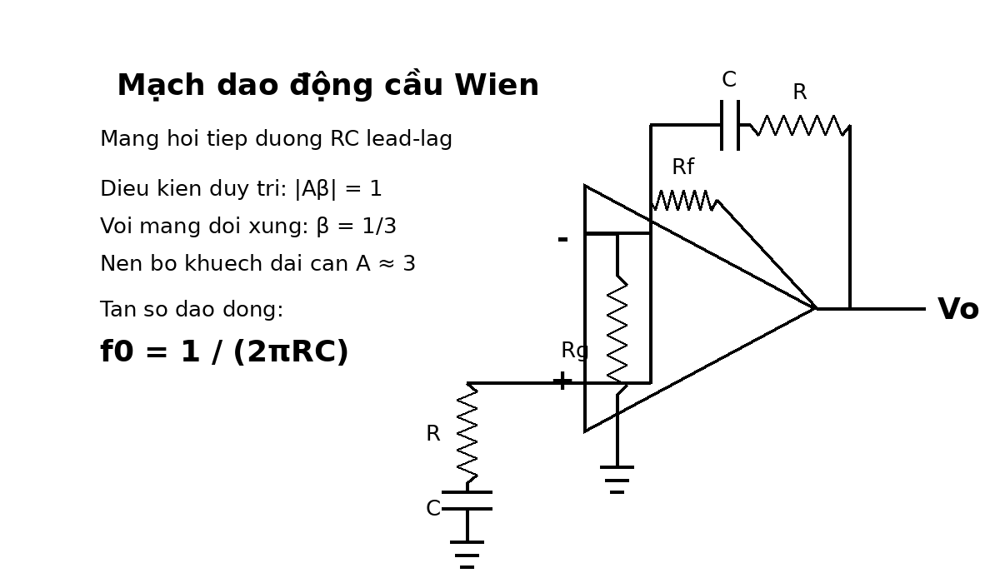

# Bài tập mạch dao động có đáp án và lời giải chi tiết

Tài liệu này tập trung vào phần **mạch dao động**, chủ yếu là:

- điều kiện Barkhausen
- dao động cầu Wien
- điều kiện khởi động
- điều kiện ổn định biên độ
- tính tần số dao động từ `R`, `C`

Mỗi bài đều có:

- hình
- yêu cầu
- đáp số ngắn
- cơ sở công thức
- lời giải chi tiết

Khi làm bài dao động, nên đi theo thứ tự:

1. Xác định loại mạch dao động.
2. Viết điều kiện pha.
3. Viết điều kiện biên độ.
4. Tìm tần số dao động.
5. Nếu là Wien, kiểm tra mạng hồi tiếp có hệ số `1/3` hay không.

## Bài 1. Điều kiện Barkhausen

{ width=90% }

**Nguồn bài**: tự biên soạn từ chương dao động

**Yêu cầu**

1. Nêu điều kiện pha của mạch dao động tự duy trì.
2. Nêu điều kiện biên độ khi khởi động và khi ổn định.
3. Giải thích ý nghĩa vật lý của từng điều kiện.

**Đáp số ngắn**

Điều kiện pha:

$$
\angle A\beta = 0^\circ \text{ hoặc } 360^\circ
$$

Điều kiện biên độ khi dao động ổn định:

$$
|A\beta|=1
$$

Điều kiện khởi động:

$$
|A\beta|>1
$$

**Cơ sở và công thức**

Điều kiện Barkhausen:

$$
A\beta = 1\angle 0^\circ
$$

Viết tách riêng:

- điều kiện pha
- điều kiện biên độ

**Lời giải chi tiết**

Muốn một mạch tự tạo dao động mà không cần tín hiệu vào ngoài, tín hiệu sau khi đi một vòng quanh mạch phải quay trở lại **cùng pha** với tín hiệu ban đầu để tự cộng tăng cường.

Do đó điều kiện pha là:

$$
\angle A\beta = 0^\circ \text{ hoặc } 360^\circ
$$

Nếu pha lệch sai, tín hiệu hồi tiếp sẽ không hỗ trợ mà có thể triệt bớt dao động.

Về biên độ:

- nếu $|A\beta|<1$ thì sau mỗi vòng, biên độ giảm dần và dao động tắt
- nếu $|A\beta|>1$ thì sau mỗi vòng, biên độ tăng dần
- khi biên độ đã tăng tới mức ổn định, cơ chế giới hạn sẽ làm nó dừng ở mức:

$$
|A\beta|=1
$$

Vì vậy:

- `khởi động` cần $|A\beta|>1$
- `duy trì ổn định` cần $|A\beta|=1$

Đây là bài nền tảng nhất của chương dao động.

---

## Bài 2. Dao động cầu Wien: tính tần số dao động

{ width=90% }

**Nguồn bài**: tự biên soạn từ chương dao động

**Yêu cầu**

Cho mạng cầu Wien đối xứng với:

$$
R=10\,\mathrm{k}\Omega,\qquad C=10\,\mathrm{nF}
$$

Hãy tính tần số dao động.

**Đáp số ngắn**

$$
f_0=\frac{1}{2\pi RC}
=\frac{1}{2\pi\cdot10\,\mathrm{k}\Omega\cdot10\,\mathrm{nF}}
\approx 1.59\,\mathrm{kHz}
$$

**Cơ sở và công thức**

Với cầu Wien đối xứng:

$$
f_0=\frac{1}{2\pi RC}
$$

**Lời giải chi tiết**

Mạch cầu Wien dùng mạng `lead-lag RC`. Khi hai điện trở bằng nhau và hai tụ bằng nhau, tần số dao động được rút gọn rất đẹp:

$$
f_0=\frac{1}{2\pi RC}
$$

Thay:

$$
R=10\,\mathrm{k}\Omega=10^4\,\Omega
$$

$$
C=10\,\mathrm{nF}=10^{-8}\,\mathrm{F}
$$

ta có:

$$
RC=10^4\cdot10^{-8}=10^{-4}
$$

Do đó:

$$
f_0=\frac{1}{2\pi\cdot10^{-4}}
\approx1591.5\,\mathrm{Hz}
$$

hay:

$$
f_0\approx1.59\,\mathrm{kHz}
$$

Đây là dạng bài tính trực tiếp phổ biến nhất của mạch dao động cầu Wien.

---

## Bài 3. Điều kiện gain của cầu Wien

{ width=90% }

**Nguồn bài**: tự biên soạn từ chương dao động

**Yêu cầu**

Biết tại tần số dao động, mạng hồi tiếp của cầu Wien có độ suy hao:

$$
\beta=\frac{1}{3}
$$

Hãy:

1. Tính độ lợi nhỏ nhất của bộ khuếch đại để mạch bắt đầu dao động.
2. Tính độ lợi khi dao động đã ổn định.

**Đáp số ngắn**

Điều kiện khởi động:

$$
|A\beta|>1
\Rightarrow
A>\frac{1}{\beta}=3
$$

Điều kiện ổn định:

$$
|A\beta|=1
\Rightarrow
A=\frac{1}{\beta}=3
$$

**Cơ sở và công thức**

Điều kiện Barkhausen:

$$
|A\beta|=1
$$

Với Wien:

$$
\beta=\frac{1}{3}
$$

**Lời giải chi tiết**

Tại tần số dao động của cầu Wien, mạng RC không chỉ cho pha bằng `0°` mà còn làm suy hao biên độ xuống còn:

$$
\beta=\frac{1}{3}
$$

Muốn sau một vòng quay lại bằng đúng biên độ cũ, bộ khuếch đại phải bù đúng phần suy hao đó:

$$
|A\beta|=1
$$

Nên:

$$
A=\frac{1}{\beta}=\frac{1}{1/3}=3
$$

Tuy nhiên nếu ban đầu đúng bằng `3` trong thực tế thì chưa chắc dao động tự khởi động tốt vì còn tổn hao và sai số. Vì vậy lúc khởi động thường cần:

$$
A>3
$$

Sau khi biên độ tăng lên, cơ chế ổn định biên độ sẽ làm gain hiệu dụng giảm về gần `3`.

Đây là ý tưởng rất quan trọng của cầu Wien: **mạng hồi tiếp suy hao 1/3 nên op-amp phải có gain xấp xỉ 3**.

---

## Bài 4. Đọc quá trình khởi động dao động

{ width=88% }

**Nguồn bài**: hình trong file tổng hợp

**Yêu cầu**

Quan sát đồ thị khởi động của mạch cầu Wien.

1. Giải thích vì sao biên độ ban đầu nhỏ.
2. Giải thích vì sao biên độ tăng dần.
3. Giải thích vì sao sau đó biên độ không tăng mãi mà ổn định lại.

**Đáp số ngắn**

- ban đầu dao động xuất phát từ nhiễu
- khi $|A\beta|>1$, biên độ tăng sau mỗi chu kỳ
- khi cơ chế ổn định làm gain hiệu dụng giảm về mức:

$$
|A\beta|=1
$$

thì biên độ dừng lại

**Cơ sở và công thức**

Khởi động:

$$
|A\beta|>1
$$

Ổn định:

$$
|A\beta|=1
$$

**Lời giải chi tiết**

Trong mạch dao động thực, luôn tồn tại nhiễu nhiệt, nhiễu linh kiện hoặc một nhiễu rất nhỏ nào đó. Chính nhiễu này là “mầm” ban đầu của dao động.

Lúc mới cấp nguồn:

- biên độ dao động gần bằng 0
- nhưng nếu mạch thỏa điều kiện pha và có:

$$
|A\beta|>1
$$

thì thành phần ở đúng tần số dao động sẽ được khuếch đại sau mỗi vòng

Do đó trên hình ta thấy biên độ tăng dần theo thời gian.

Nếu để gain luôn lớn hơn `3` trong cầu Wien, biên độ sẽ tiếp tục tăng đến khi op-amp bão hòa và dạng sóng méo. Vì vậy mạch thực luôn có cơ chế ổn định:

- đèn sợi đốt
- diode
- điện trở phi tuyến
- điều khiển gain tự động

Những cơ chế này làm gain hiệu dụng giảm khi biên độ tăng, và cuối cùng đưa mạch về:

$$
|A\beta|=1
$$

Khi đó biên độ ổn định và sóng sin duy trì gần đều.

---

## Bài 5. Thiết kế lại Wien theo tần số yêu cầu

{ width=90% }

**Nguồn bài**: tự biên soạn

**Yêu cầu**

Muốn thiết kế mạch dao động cầu Wien có:

$$
f_0=2\,\mathrm{kHz}
$$

Nếu chọn:

$$
C=10\,\mathrm{nF}
$$

hãy tính giá trị $R$ cần dùng.

**Đáp số ngắn**

$$
R=\frac{1}{2\pi f_0 C}
=\frac{1}{2\pi\cdot2000\cdot10\,\mathrm{nF}}
\approx7.96\,\mathrm{k}\Omega
$$

Có thể chọn gần đúng:

$$
R\approx8.2\,\mathrm{k}\Omega
$$

**Cơ sở và công thức**

Với cầu Wien đối xứng:

$$
f_0=\frac{1}{2\pi RC}
$$

Suy ra:

$$
R=\frac{1}{2\pi f_0 C}
$$

**Lời giải chi tiết**

Bài thiết kế ngược chỉ là biến đổi công thức tần số dao động.

Ta có:

$$
R=\frac{1}{2\pi f_0 C}
$$

Thay:

$$
f_0=2000\,\mathrm{Hz},\qquad C=10\,\mathrm{nF}=10^{-8}\,\mathrm{F}
$$

thì:

$$
R=\frac{1}{2\pi\cdot2000\cdot10^{-8}}
\approx7957.7\,\Omega
$$

hay:

$$
R\approx7.96\,\mathrm{k}\Omega
$$

Trong thực hành có thể chọn `8.2 kΩ`, rồi chấp nhận tần số thực tế lệch nhẹ hoặc tinh chỉnh bằng biến trở.

---

## Bài 6. Tính gain từ cấu hình không đảo để thỏa Wien

{ width=90% }

**Nguồn bài**: tự biên soạn

**Yêu cầu**

Giả sử bộ khuếch đại trong mạch cầu Wien mắc không đảo với độ lợi:

$$
A=1+\frac{R_f}{R_g}
$$

Muốn mạch dao động ổn định, cần:

$$
A\approx3
$$

Nếu chọn:

$$
R_g=10\,\mathrm{k}\Omega
$$

hãy tính $R_f$.

**Đáp số ngắn**

$$
3=1+\frac{R_f}{R_g}
$$

$$
\frac{R_f}{R_g}=2
$$

$$
R_f=2R_g=20\,\mathrm{k}\Omega
$$

**Cơ sở và công thức**

Mạch không đảo:

$$
A=1+\frac{R_f}{R_g}
$$

Với Wien:

$$
A\approx3
$$

**Lời giải chi tiết**

Vì mạng hồi tiếp dương của cầu Wien có:

$$
\beta=\frac{1}{3}
$$

nên mạch ổn định khi:

$$
A\beta=1
\Rightarrow
A=3
$$

Với op-amp không đảo:

$$
A=1+\frac{R_f}{R_g}
$$

Suy ra:

$$
3=1+\frac{R_f}{R_g}
\Rightarrow
\frac{R_f}{R_g}=2
$$

Nếu:

$$
R_g=10\,\mathrm{k}\Omega
$$

thì:

$$
R_f=20\,\mathrm{k}\Omega
$$

Đây là bài nối trực tiếp giữa điều kiện Barkhausen và mạch điện trở thực tế của op-amp.

