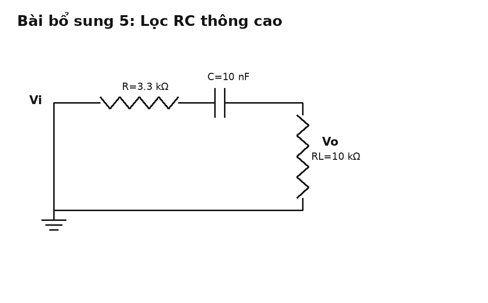
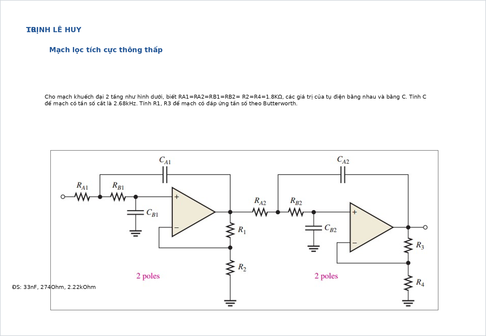
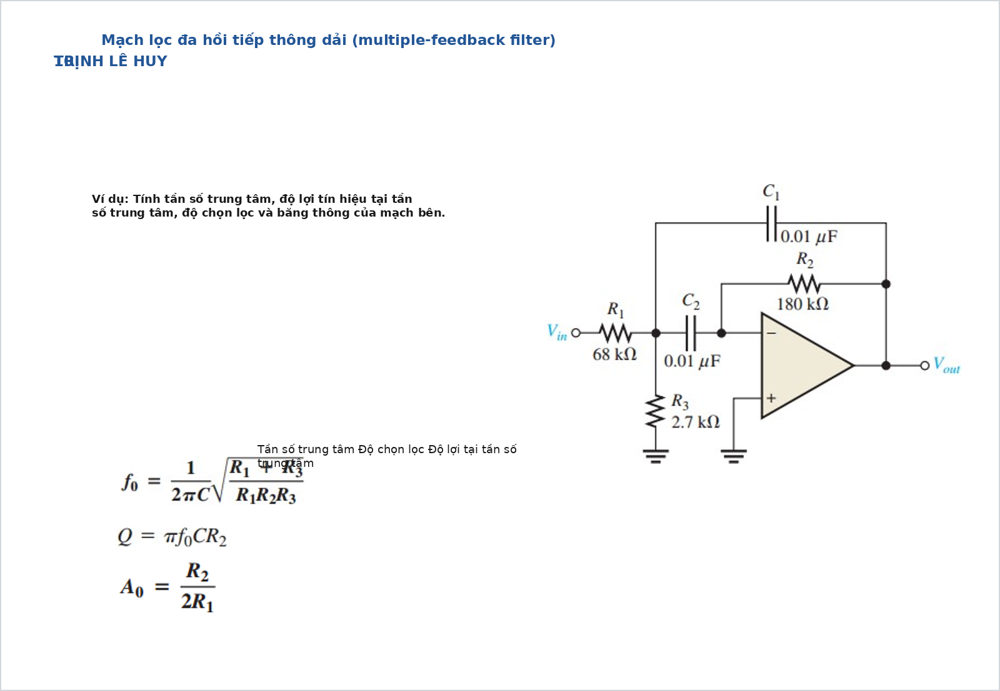

# Bài tập đáp ứng tần số có đáp án và lời giải chi tiết

Tài liệu này tập trung vào các bài về **đáp ứng tần số** và **mạch lọc**. Mỗi bài đều có:

- hình mạch
- yêu cầu
- đáp số ngắn
- cơ sở công thức
- lời giải chi tiết

Khi giải bài đáp ứng tần số, nên đi theo thứ tự:

1. Nhận dạng loại mạch: thông thấp, thông cao, thông dải, chắn dải.
2. Xác định mạch bậc mấy.
3. Tính tần số đặc trưng: $f_c$ hoặc $f_0$.
4. Nếu cần, tính độ lợi trong dải thông.
5. Kiểm tra thêm `Q`, `BW`, `roll-off` khi bài là lọc bậc hai trở lên.

## Bài 1. Mạch RC thông cao bậc một có tải

{ width=84% }

**Nguồn bài**: tự tạo thêm từ thư mục hiện tại

**Yêu cầu**

1. Xác định loại mạch lọc.
2. Tính tần số cắt xấp xỉ.
3. Tính độ lợi ở tần số cao.

**Đáp số ngắn**

Đây là mạch **thông cao RC bậc một**.

Điện trở mà tụ nhìn thấy gần đúng là:

$$
R_{\mathrm{eq}} = R + R_L = 3.3\,\mathrm{k}\Omega + 10\,\mathrm{k}\Omega = 13.3\,\mathrm{k}\Omega
$$

Nên:

$$
f_c=\frac{1}{2\pi R_{\mathrm{eq}}C}
=\frac{1}{2\pi\cdot13.3\,\mathrm{k}\Omega\cdot10\,\mathrm{nF}}
\approx 1.20\,\mathrm{kHz}
$$

Ở tần số cao:

$$
A_v(\infty)=\frac{R_L}{R+R_L}
=\frac{10}{13.3}\approx 0.752
$$

**Cơ sở và công thức**

Với lọc RC bậc một:

$$
f_c=\frac{1}{2\pi RC}
$$

Khi có tải, cần dùng điện trở tương đương mà tụ thực sự nhìn thấy.

Ở tần số rất cao, tụ gần như ngắn mạch, mạch còn lại là chia áp điện trở:

$$
A_v(\infty)=\frac{R_L}{R+R_L}
$$

**Lời giải chi tiết**

Quan sát mạch:

- tụ mắc nối tiếp ở ngõ vào
- điện áp ra lấy trên điện trở xuống mass

Đó là cấu trúc kinh điển của **lọc thông cao**.

Vì có tải $R_L$, tần số cắt không chỉ phụ thuộc vào một điện trở duy nhất mà phụ thuộc điện trở tương đương theo cách gần đúng trong bài:

$$
R_{\mathrm{eq}} \approx R + R_L
$$

Do đó:

$$
f_c=\frac{1}{2\pi\cdot13.3\,\mathrm{k}\Omega\cdot10\,\mathrm{nF}}
\approx1.20\,\mathrm{kHz}
$$

Về mặt vật lý:

- khi $f \ll f_c$, dung kháng tụ lớn nên tín hiệu qua kém
- khi $f \gg f_c$, tụ gần như dây nối nên tín hiệu qua tốt hơn

Lúc đó điện áp ra do chia áp giữa $R$ và $R_L$:

$$
A_v(\infty)=\frac{R_L}{R+R_L}=\frac{10}{13.3}\approx0.752
$$

Đây là dạng bài cơ bản nhất của đáp ứng tần số.

---

## Bài 2. Lọc tích cực thông thấp Sallen-Key

{ width=92% }

**Nguồn bài**: chọn từ [Giai_BT_Slide.md](/home/hiimfelix/Note/MĐT/bai_giai_slide/Giai_BT_Slide.md)

**Yêu cầu**

1. Tính tần số cắt $f_c$.
2. Tính độ lợi cần thiết để được đáp ứng Butterworth.
3. Suy ra điện trở hồi tiếp theo dữ kiện đề.

**Đáp số ngắn**

Với Sallen-Key thông thấp bậc hai đối xứng:

$$
f_c=\frac{1}{2\pi RC}
$$

Từ giá trị trên hình:

$$
f_c\approx7.23\,\mathrm{kHz}
$$

Điều kiện Butterworth:

$$
A_v = 3 - D \approx 1.586
$$

Với mạch không đảo:

$$
A_v=1+\frac{R_2}{R_1}
$$

và slide cho:

$$
R_1\approx586\,\Omega
$$

**Cơ sở và công thức**

Tần số cắt của Sallen-Key đối xứng:

$$
f_c=\frac{1}{2\pi RC}
$$

Đáp ứng Butterworth bậc hai thường quy về chọn độ lợi:

$$
A_v\approx1.586
$$

Nếu op-amp mắc không đảo:

$$
A_v=1+\frac{R_2}{R_1}
$$

**Lời giải chi tiết**

Bài này có hai phần riêng:

1. phần xác định tần số cắt bằng `R`, `C`
2. phần chỉnh dạng đáp ứng bằng độ lợi vòng kín

Trước hết:

$$
f_c=\frac{1}{2\pi RC}
$$

Thay trực tiếp giá trị `R`, `C` trong hình sẽ được:

$$
f_c\approx7.23\,\mathrm{kHz}
$$

Tiếp theo, bộ lọc không chỉ cần đúng tần số cắt mà còn cần đúng **hình dạng đáp ứng**. Nếu muốn đáp ứng Butterworth, ta cần độ lợi:

$$
A_v\approx1.586
$$

Vì tầng op-amp là không đảo:

$$
A_v=1+\frac{R_2}{R_1}
$$

nên từ một điện trở đã biết ta suy ra điện trở còn lại. Đây là kiểu bài rất hay gặp: `f_c` do mạng `RC` quyết định, còn độ phẳng/độ nhọn do gain quyết định.

---

## Bài 3. Lọc thông thấp hai tầng

{ width=92% }

**Nguồn bài**: chọn từ [Giai_BT_Slide.md](/home/hiimfelix/Note/MĐT/bai_giai_slide/Giai_BT_Slide.md)

**Yêu cầu**

1. Tính tụ $C$ để đạt tần số cắt yêu cầu.
2. Tính các điện trở hồi tiếp để đạt đáp ứng Butterworth bậc cao.
3. Giải thích vì sao hai tầng không dùng cùng một gain.

**Đáp số ngắn**

Với mỗi tầng:

$$
f_c=\frac{1}{2\pi RC}
$$

Cho:

$$
R=1.8\,\mathrm{k}\Omega,\quad f_c=2.68\,\mathrm{kHz}
$$

thì:

$$
C=\frac{1}{2\pi\cdot1.8\,\mathrm{k}\Omega\cdot2.68\,\mathrm{kHz}}
\approx33\,\mathrm{nF}
$$

Theo slide:

$$
R_1\approx274\,\Omega,\qquad R_3\approx2.22\,\mathrm{k}\Omega
$$

**Cơ sở và công thức**

Mỗi tầng Sallen-Key đối xứng vẫn dùng:

$$
f_c=\frac{1}{2\pi RC}
$$

Nhưng khi ghép nhiều tầng để được đáp ứng Butterworth bậc cao, mỗi tầng phải có hệ số hãm riêng. Vì vậy gain từng tầng không nhất thiết giống nhau.

**Lời giải chi tiết**

Đây là bài mở rộng từ bài 2. Điểm khác là bây giờ bộ lọc gồm **hai tầng**.

Phần tính tụ vẫn trực tiếp:

$$
C=\frac{1}{2\pi RC}
$$

Thay số:

$$
C=\frac{1}{2\pi\cdot1.8\,\mathrm{k}\Omega\cdot2.68\,\mathrm{kHz}}
\approx33\,\mathrm{nF}
$$

Điểm khó hơn nằm ở phần Butterworth bậc cao. Khi ghép nhiều tầng bậc hai, không thể cho mọi tầng cùng một gain nếu muốn đáp ứng tổng tối ưu. Mỗi tầng phải nhận một hệ số phù hợp với đa thức Butterworth.

Do đó slide cho sẵn các điện trở:

$$
R_1\approx274\,\Omega,\qquad R_3\approx2.22\,\mathrm{k}\Omega
$$

Ý nghĩa của chúng không chỉ là “đặt gain”, mà là “đặt đúng damping của từng tầng”.

---

## Bài 4. Lọc tích cực thông cao

{ width=92% }

**Nguồn bài**: chọn từ [Giai_BT_Slide.md](/home/hiimfelix/Note/MĐT/bai_giai_slide/Giai_BT_Slide.md)

**Yêu cầu**

1. Thiết kế $R$ hoặc $C$ để đạt $f_c$ yêu cầu.
2. Chọn gain để được đáp ứng Butterworth.

**Đáp số ngắn**

Với thông cao bậc hai đối xứng:

$$
f_c=\frac{1}{2\pi RC}
$$

Cho:

$$
f_c=20\,\mathrm{kHz},\quad C=1\,\mathrm{nF}
$$

thì:

$$
R=\frac{1}{2\pi f_c C}
\approx7.96\,\mathrm{k}\Omega
$$

Điều kiện Butterworth:

$$
A_v\approx1.586
$$

Nên:

$$
1+\frac{R_2}{R_1}=1.586
$$

Ví dụ:

$$
R_1=10\,\mathrm{k}\Omega,\quad R_2=5.86\,\mathrm{k}\Omega
$$

**Cơ sở và công thức**

Thông cao Sallen-Key đối xứng có cùng dạng:

$$
f_c=\frac{1}{2\pi RC}
$$

Điều kiện Butterworth vẫn quy về chọn gain:

$$
A_v\approx1.586
$$

**Lời giải chi tiết**

Đây là bài thiết kế ngược: đề cho $f_c$, ta phải suy ra linh kiện.

Chọn trước một giá trị tụ tiện dụng:

$$
C=1\,\mathrm{nF}
$$

thì:

$$
R=\frac{1}{2\pi\cdot20\,\mathrm{kHz}\cdot1\,\mathrm{nF}}
\approx7.96\,\mathrm{k}\Omega
$$

Có thể chọn giá trị thương mại gần nhất như `8.2 kΩ`.

Sau đó vẫn phải đảm bảo đáp ứng Butterworth bằng cách chọn:

$$
A_v\approx1.586
$$

Nếu là mạch không đảo:

$$
A_v=1+\frac{R_2}{R_1}
$$

nên chỉ cần chọn một điện trở trước rồi suy ra điện trở còn lại.

Về bản chất:

- `RC` quyết định vị trí cắt
- gain quyết định hình dạng đáp ứng

---

## Bài 5. Lọc thông dải đa hồi tiếp

{ width=92% }

**Nguồn bài**: chọn từ [Giai_BT_Slide.md](/home/hiimfelix/Note/MĐT/bai_giai_slide/Giai_BT_Slide.md)

**Yêu cầu**

1. Tính tần số trung tâm $f_0$.
2. Tính độ lợi tại tần số trung tâm.
3. Tính hệ số chọn lọc $Q$ và băng thông $BW$.

**Đáp số ngắn**

Với MFB band-pass và hai tụ bằng nhau:

$$
f_0=\frac{1}{2\pi C}\sqrt{\frac{R_1+R_3}{R_1R_2R_3}}
$$

Độ lợi tại tần số trung tâm:

$$
A_0=\frac{R_2}{2R_1}
$$

Hệ số chọn lọc:

$$
Q=\frac{f_0}{BW}
$$

Băng thông:

$$
BW=\frac{f_0}{Q}
$$

**Cơ sở và công thức**

Đây là bộ lọc thông dải bậc hai, nên ngoài tần số trung tâm còn phải quan tâm:

- độ rộng dải thông
- độ nhọn của đỉnh cộng hưởng

Các đại lượng đó được mô tả bằng `BW` và `Q`.

**Lời giải chi tiết**

Khác với thông thấp và thông cao, bài thông dải không chỉ có một tần số cắt duy nhất mà có:

- tần số cắt dưới $f_L$
- tần số cắt trên $f_H$
- tần số trung tâm $f_0$

Trong dạng bài slide này, ta dùng công thức rút gọn:

$$
f_0=\frac{1}{2\pi C}\sqrt{\frac{R_1+R_3}{R_1R_2R_3}}
$$

Sau đó tính độ lợi tại đỉnh:

$$
A_0=\frac{R_2}{2R_1}
$$

Nếu đề cho hoặc suy ra được $Q$, thì băng thông là:

$$
BW=\frac{f_0}{Q}
$$

Ngược lại, nếu biết băng thông thì:

$$
Q=\frac{f_0}{BW}
$$

Đây là dạng bài rất tiêu biểu cho chương đáp ứng tần số vì nó buộc bạn phải liên hệ giữa mạch thực và các khái niệm đồ thị như `đỉnh cộng hưởng`, `độ chọn lọc`, `băng thông`.

