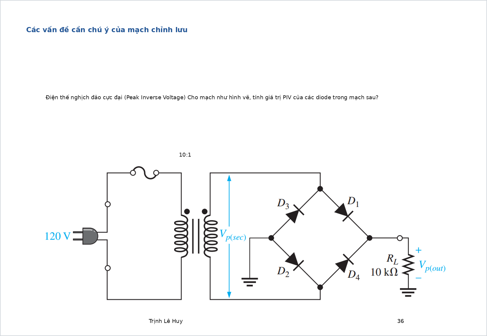

# Bài tập diode có đáp án và lời giải chi tiết

Tài liệu này chỉ tập trung vào **diode**. Mỗi bài đều có:

- hình mạch
- yêu cầu
- đáp số ngắn
- cơ sở công thức
- lời giải chi tiết

Khi làm bài diode, nên đi theo thứ tự:

1. Xác định diode thuận hay nghịch.
2. Chọn mô hình: lý tưởng hay thực với $V_D \approx 0.7\,\mathrm{V}$.
3. Nếu là chỉnh lưu, xác định bán kỳ hay toàn kỳ.
4. Nếu có tụ lọc, tính gợn và điện áp DC gần đúng.
5. Nếu là Zener, kiểm tra miền ổn áp và công suất.

## Bài 1. Dạng sóng chỉnh lưu

{ width=92% }

**Nguồn bài**: chọn từ [Giai_BT_Slide.md](/home/hiimfelix/Note/MĐT/bai_giai_slide/Giai_BT_Slide.md)

**Yêu cầu**

1. So sánh điện áp đỉnh đầu ra của chỉnh lưu bán kỳ và toàn kỳ cầu.
2. Tính sai số tương đối do sụt áp diode nếu dùng mô hình thực.

**Đáp số ngắn**

- Bán kỳ:

$$
V_{om}\approx V_{im}-V_D
$$

- Cầu toàn kỳ:

$$
V_{om}\approx V_{im}-2V_D
$$

Sai số:

$$
\varepsilon = \frac{nV_D}{V_{im}}\cdot100\%
$$

với:

- $n=1$ cho bán kỳ
- $n=2$ cho cầu chỉnh lưu

**Cơ sở và công thức**

Mỗi diode silicon dẫn thuận có sụt áp gần đúng:

$$
V_D\approx0.7\,\mathrm{V}
$$

Trong chỉnh lưu cầu, mỗi nửa chu kỳ có hai diode nối tiếp cùng dẫn.

**Lời giải chi tiết**

Với chỉnh lưu bán kỳ, trong nửa chu kỳ thuận chỉ có một diode dẫn nên đầu ra mất đi khoảng:

$$
V_D\approx0.7\,\mathrm{V}
$$

Do đó:

$$
V_{om}\approx V_{im}-V_D
$$

Với chỉnh lưu cầu, dòng đi qua hai diode dẫn nối tiếp trong mỗi nửa chu kỳ, nên tổng sụt áp gần đúng là:

$$
2V_D
$$

Vì vậy:

$$
V_{om}\approx V_{im}-2V_D
$$

Nếu muốn đánh giá mức ảnh hưởng của mô hình thực, dùng:

$$
\varepsilon = \frac{nV_D}{V_{im}}\cdot100\%
$$

Khi $V_{im}$ lớn hơn nhiều so với $0.7\,\mathrm{V}$ thì sai số nhỏ và có thể tính nhanh bằng mô hình lý tưởng.

---

## Bài 2. PIV của cầu chỉnh lưu

{ width=92% }

**Nguồn bài**: chọn từ [Giai_BT_Slide.md](/home/hiimfelix/Note/MĐT/bai_giai_slide/Giai_BT_Slide.md)

**Yêu cầu**

1. Tính điện áp thứ cấp của biến áp.
2. Tính điện áp đỉnh phía thứ cấp.
3. Xác định PIV của diode trong cầu chỉnh lưu.

**Đáp số ngắn**

Nếu biến áp có tỉ số `10:1`:

$$
V_s(\mathrm{rms})=\frac{V_p(\mathrm{rms})}{10}
$$

$$
V_s(\mathrm{peak})=\sqrt{2}\,V_s(\mathrm{rms})
$$

Với cầu chỉnh lưu:

$$
PIV_{\mathrm{bridge}}\approx V_s(\mathrm{peak})
$$

**Cơ sở và công thức**

Trong cầu chỉnh lưu, diode không dẫn phải chịu điện áp ngược xấp xỉ bằng đỉnh điện áp thứ cấp.

**Lời giải chi tiết**

Từ tỉ số biến áp:

$$
V_s(\mathrm{rms})=\frac{V_p(\mathrm{rms})}{10}
$$

Sau đó đổi từ giá trị hiệu dụng sang giá trị đỉnh:

$$
V_s(\mathrm{peak})=\sqrt{2}\,V_s(\mathrm{rms})
$$

Trong cầu chỉnh lưu, diode đang khóa phải chịu xấp xỉ điện áp đỉnh phía thứ cấp, nên:

$$
PIV_{\mathrm{bridge}}\approx V_s(\mathrm{peak})
$$

Khi chọn diode thực tế, nên chọn định mức điện áp ngược lớn hơn giá trị tính được ít nhất khoảng 2 lần để có biên an toàn.

---

## Bài 3. Nhấp nhô nguồn DC có tụ lọc

{ width=92% }

**Nguồn bài**: chọn từ [Giai_BT_Slide.md](/home/hiimfelix/Note/MĐT/bai_giai_slide/Giai_BT_Slide.md)

**Yêu cầu**

1. Tính tần số gợn của chỉnh lưu cầu có tụ lọc.
2. Tính $V_r(pp)$, $V_r(rms)$ và hệ số nhấp nhô $r$.
3. Giải thích cách giảm gợn sóng.

**Đáp số ngắn**

Với chỉnh lưu cầu:

$$
f_r=2f_{\mathrm{line}}
$$

Điện áp gợn đỉnh-đỉnh gần đúng:

$$
V_r(pp)\approx\frac{I_L}{f_r C}
$$

Giá trị hiệu dụng của gợn tam giác:

$$
V_r(rms)=\frac{V_r(pp)}{2\sqrt{3}}
$$

Hệ số nhấp nhô:

$$
r=\frac{V_r(rms)}{V_{DC}}
$$

**Cơ sở và công thức**

Với tụ lọc:

- diode chỉ nạp tụ gần đỉnh sóng
- giữa hai lần nạp, tụ xả qua tải

Chính quá trình xả này sinh ra gợn điện áp.

**Lời giải chi tiết**

Do cầu chỉnh lưu sử dụng cả hai bán kỳ nên tần số nạp lại của tụ gấp đôi tần số lưới:

$$
f_r=2f_{\mathrm{line}}
$$

Nếu tải hút dòng gần như không đổi, gợn điện áp đỉnh-đỉnh được ước lượng:

$$
V_r(pp)\approx\frac{I_L}{f_r C}
$$

Nếu xem gợn là sóng tam giác, giá trị hiệu dụng là:

$$
V_r(rms)=\frac{V_r(pp)}{2\sqrt{3}}
$$

Do đó hệ số nhấp nhô:

$$
r=\frac{V_r(rms)}{V_{DC}}
$$

Muốn giảm gợn:

- tăng `C`
- tăng `R_L` để giảm dòng tải
- dùng chỉnh lưu toàn kỳ thay vì bán kỳ

Đây là dạng bài rất hay gặp trong phần diode nguồn DC.

---

## Bài 4. Ổn áp Zener

{ width=92% }

**Nguồn bài**: chọn từ [Giai_BT_Slide.md](/home/hiimfelix/Note/MĐT/bai_giai_slide/Giai_BT_Slide.md)

**Yêu cầu**

1. Tính dòng qua điện trở hạn dòng.
2. Tính dòng tải và dòng Zener.
3. Kiểm tra điều kiện ổn áp.
4. Tính điện áp vào tối thiểu để bắt đầu ổn áp.

**Đáp số ngắn**

Khi Zener làm việc đúng vùng:

$$
V_{OUT}\approx V_Z
$$

Dòng qua điện trở:

$$
I_R=\frac{V_{IN}-V_Z}{R}
$$

Dòng tải:

$$
I_L=\frac{V_Z}{R_L}
$$

Dòng Zener:

$$
I_Z=I_R-I_L
$$

Điều kiện ổn áp:

$$
I_Z(\min)\le I_Z \le I_Z(\max)
$$

Điện áp vào tối thiểu:

$$
V_{IN}(\min)=V_Z+R\big(I_L+I_Z(\min)\big)
$$

**Cơ sở và công thức**

Zener ổn áp khi được phân cực nghịch trong vùng đánh thủng ổn áp.

**Lời giải chi tiết**

Khi Zener đang ổn áp, điện áp ra gần như cố định:

$$
V_{OUT}\approx V_Z
$$

Từ đó dòng qua điện trở hạn dòng là:

$$
I_R=\frac{V_{IN}-V_Z}{R}
$$

Nếu có tải:

$$
I_L=\frac{V_Z}{R_L}
$$

nên dòng còn lại chạy qua Zener là:

$$
I_Z=I_R-I_L
$$

Muốn Zener giữ được ổn áp thì không chỉ cần dẫn, mà còn phải dẫn trong đúng khoảng cho phép:

$$
I_Z(\min)\le I_Z \le I_Z(\max)
$$

Nếu muốn tìm điện áp vào tối thiểu để bắt đầu ổn áp, ta lấy trường hợp biên:

$$
I_Z=I_Z(\min)
$$

và suy ra:

$$
V_{IN}(\min)=V_Z+R\big(I_L+I_Z(\min)\big)
$$

Đây là dạng bài điển hình của phần Zener.

---

## Bài 5. Diode nối tiếp tự luyện

{ width=84% }

**Nguồn bài**: tự tạo thêm từ thư mục hiện tại

**Yêu cầu**

Cho diode silicon có:

$$
V_D\approx0.7\,\mathrm{V}
$$

Hãy tính:

1. Dòng mạch
2. Điện áp ra trên tải

**Đáp số ngắn**

Tổng điện trở nối tiếp:

$$
R+R_L=1\,\mathrm{k}\Omega+2\,\mathrm{k}\Omega=3\,\mathrm{k}\Omega
$$

Dòng mạch:

$$
I=\frac{12-0.7}{3\,\mathrm{k}\Omega}=3.77\,\mathrm{mA}
$$

Điện áp ra:

$$
V_o=IR_L=3.77\,\mathrm{mA}\cdot2\,\mathrm{k}\Omega=7.53\,\mathrm{V}
$$

**Cơ sở và công thức**

Khi diode dẫn thuận, dùng KVL:

$$
V_i=V_D+I(R+R_L)
$$

**Lời giải chi tiết**

Do diode phân cực thuận nên lấy sụt áp gần đúng:

$$
V_D\approx0.7\,\mathrm{V}
$$

Tổng điện trở nối tiếp của nhánh là:

$$
R+R_L=3\,\mathrm{k}\Omega
$$

Nên:

$$
I=\frac{12-0.7}{3\,\mathrm{k}\Omega}=3.77\,\mathrm{mA}
$$

Điện áp trên tải:

$$
V_o=IR_L=3.77\,\mathrm{mA}\cdot2\,\mathrm{k}\Omega=7.53\,\mathrm{V}
$$

Đây là bài nền tảng để luyện cách xét diode thuận theo mô hình thực đơn giản.

