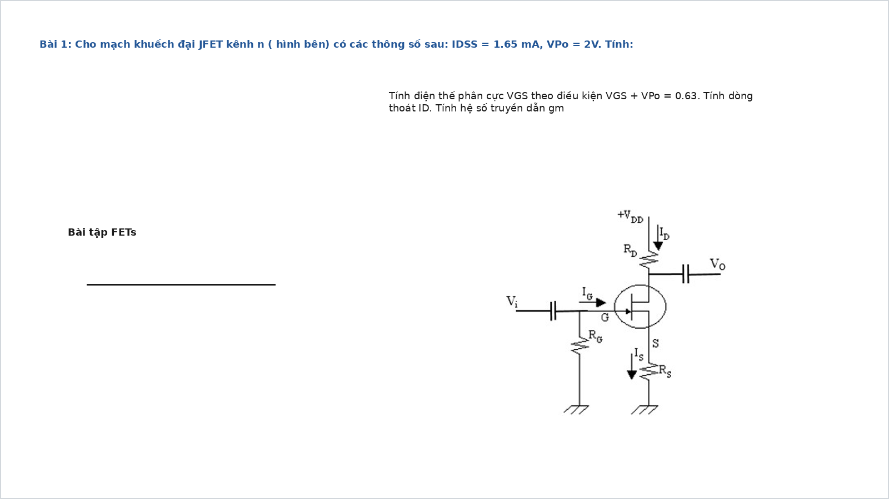
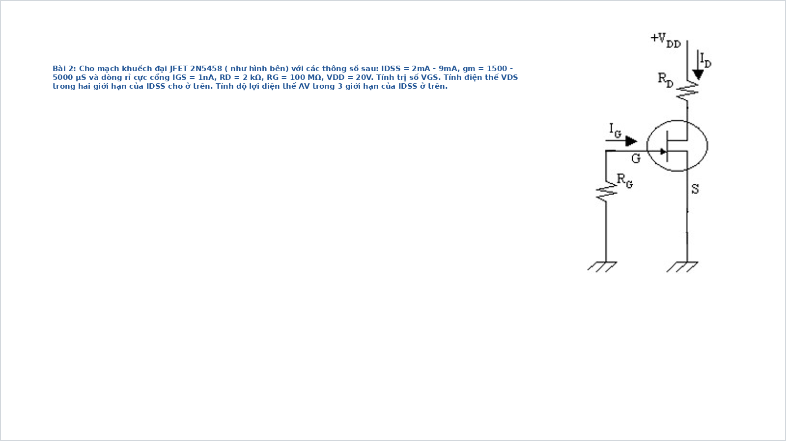
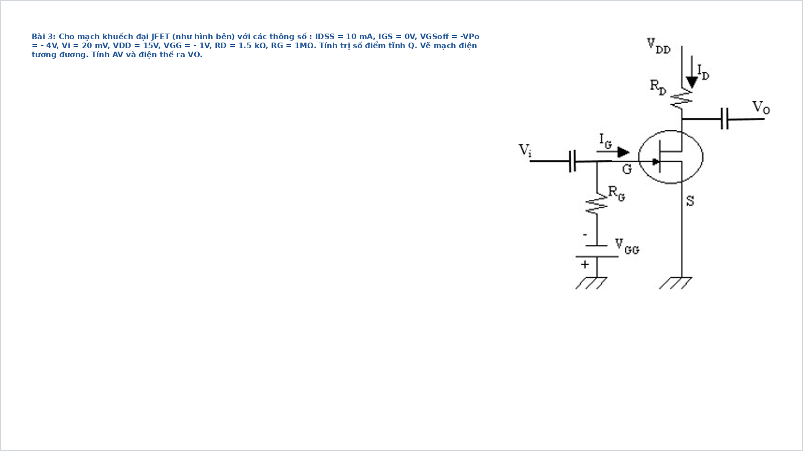
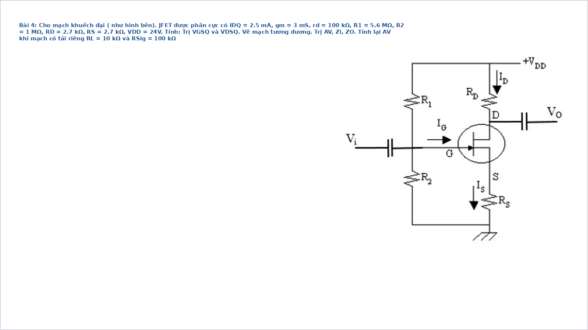
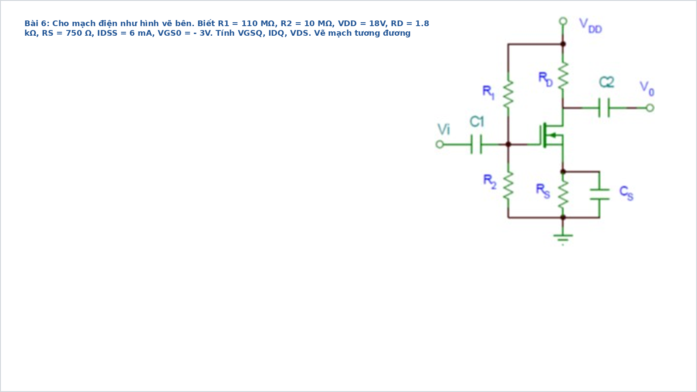
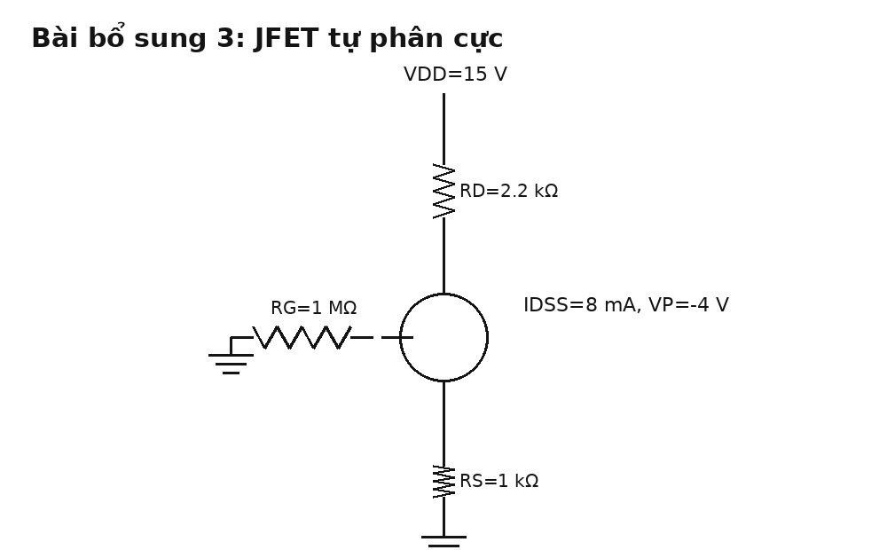

# Bài tập JFET có đáp án và lời giải chi tiết

Tài liệu này chỉ tập trung vào **JFET**. Mỗi bài đều có:

- hình mạch
- yêu cầu
- đáp số ngắn
- cơ sở công thức
- lời giải chi tiết

Khi giải JFET, nên đi theo thứ tự:

1. Tìm $V_G$, $V_S$, từ đó suy ra $V_{GS}$.
2. Dùng phương trình Shockley để tìm $I_D$.
3. Tính $V_D$, $V_{DS}$ để chốt điểm Q.
4. Nếu bài có AC, tính $g_m$ rồi mới tính độ lợi.

## Bài 1. JFET cơ bản với Shockley

{ width=92% }

**Nguồn bài**: chọn từ [Giai_BT_Slide.md](/home/hiimfelix/Note/MĐT/bai_giai_slide/Giai_BT_Slide.md)

**Yêu cầu**

Cho $I_{DSS}=1.65\,\mathrm{mA}$, $V_{PO}=2\,\mathrm{V}$ và điều kiện:

$$
V_{GS}+V_{PO}=0.63
$$

Hãy tính:

1. $V_{GS}$
2. $I_D$
3. $g_{m0}$ và $g_m$

**Đáp số ngắn**

$$
V_{GS}=0.63-2=-1.37\,\mathrm{V}
$$

$$
I_D=I_{DSS}\left(1-\frac{V_{GS}}{V_P}\right)^2
\approx 0.164\,\mathrm{mA}
$$

$$
g_{m0}=\frac{2I_{DSS}}{|V_P|}=1.65\,\mathrm{mS}
$$

$$
g_m=g_{m0}\left(1-\frac{V_{GS}}{V_P}\right)\approx 0.52\,\mathrm{mS}
$$

**Cơ sở và công thức**

Phương trình Shockley:

$$
I_D=I_{DSS}\left(1-\frac{V_{GS}}{V_P}\right)^2
$$

Độ dẫn truyền cực đại:

$$
g_{m0}=\frac{2I_{DSS}}{|V_P|}
$$

Độ dẫn truyền tại điểm làm việc:

$$
g_m=g_{m0}\left(1-\frac{V_{GS}}{V_P}\right)
$$

**Lời giải chi tiết**

Từ điều kiện đề bài:

$$
V_{GS}+V_{PO}=0.63
$$

với $V_{PO}=2\,\mathrm{V}$, suy ra:

$$
V_{GS}=0.63-2=-1.37\,\mathrm{V}
$$

Với JFET kênh N, ta dùng $V_P=-2\,\mathrm{V}$ trong phương trình Shockley:

$$
I_D=1.65\,\mathrm{mA}\left(1-\frac{-1.37}{-2}\right)^2
$$

$$
I_D=1.65\,\mathrm{mA}(0.315)^2\approx 0.164\,\mathrm{mA}
$$

Tiếp theo:

$$
g_{m0}=\frac{2(1.65\,\mathrm{mA})}{2}=1.65\,\mathrm{mS}
$$

$$
g_m=1.65\,\mathrm{mS}\cdot0.315\approx0.52\,\mathrm{mS}
$$

Đây là dạng bài nền tảng nhất của JFET: biết $V_{GS}$ thì mọi đại lượng còn lại đi ra từ Shockley.

---

## Bài 2. JFET 2N5458 và khoảng biến thiên độ lợi

{ width=92% }

**Nguồn bài**: chọn từ [Giai_BT_Slide.md](/home/hiimfelix/Note/MĐT/bai_giai_slide/Giai_BT_Slide.md)

**Yêu cầu**

1. Tính gần đúng $V_{GS}$ do dòng rỉ gate tạo ra.
2. Ước lượng $V_{DS}$ theo dải $I_D$ của linh kiện.
3. Tính khoảng biến thiên độ lợi điện áp.

**Đáp số ngắn**

$$
V_{GS}\approx -I_{GS}R_G=-(1\,\mathrm{nA})(100\,\mathrm{M}\Omega)=-0.1\,\mathrm{V}
$$

Nếu $I_D=2\,\mathrm{mA}$:

$$
V_{DS}\approx 16\,\mathrm{V}
$$

Nếu $I_D=9\,\mathrm{mA}$:

$$
V_{DS}\approx 2\,\mathrm{V}
$$

Độ lợi:

$$
A_v\approx -g_mR_D
$$

nên nằm khoảng:

$$
-3 \text{ đến } -10
$$

**Cơ sở và công thức**

Với JFET, dòng cổng rất nhỏ:

$$
V_{GS}\approx -I_{GS}R_G
$$

Điện áp drain-source:

$$
V_{DS}=V_{DD}-I_DR_D
$$

Độ lợi mạch CS gần đúng:

$$
A_v\approx -g_mR_D
$$

**Lời giải chi tiết**

Điểm quan trọng của bài này là JFET có dòng cổng cực nhỏ, nên chỉ một dòng `nA` qua điện trở `MΩ` cũng tạo ra điện áp phân cực đáng kể.

Ta có:

$$
V_{GS}\approx -(1\,\mathrm{nA})(100\,\mathrm{M}\Omega)=-0.1\,\mathrm{V}
$$

Vì $V_{GS}$ rất gần `0`, dòng drain có thể nằm trong dải khá rộng do sai số linh kiện. Đề cho dải dòng từ `2 mA` đến `9 mA`.

Khi đó:

$$
V_{DS}=20-I_D\cdot2\,\mathrm{k}\Omega
$$

Nếu $I_D=2\,\mathrm{mA}$:

$$
V_{DS}=20-2\,\mathrm{mA}\cdot2\,\mathrm{k}\Omega=16\,\mathrm{V}
$$

Nếu $I_D=9\,\mathrm{mA}$:

$$
V_{DS}=20-9\,\mathrm{mA}\cdot2\,\mathrm{k}\Omega=2\,\mathrm{V}
$$

Với độ lợi:

$$
A_v\approx -g_mR_D
$$

Nếu $g_m=1500\,\mu\mathrm{S}$:

$$
A_v\approx -0.0015\cdot2000=-3
$$

Nếu $g_m=5000\,\mu\mathrm{S}$:

$$
A_v\approx -0.005\cdot2000=-10
$$

Kết luận: bài này nhấn mạnh tính phân tán tham số rất mạnh của JFET thực tế.

---

## Bài 3. JFET điểm tĩnh và độ lợi

{ width=92% }

**Nguồn bài**: chọn từ [Giai_BT_Slide.md](/home/hiimfelix/Note/MĐT/bai_giai_slide/Giai_BT_Slide.md)

**Yêu cầu**

Cho $I_{DSS}=10\,\mathrm{mA}$, $V_P=-4\,\mathrm{V}$, $V_{GS}=-1\,\mathrm{V}$, $R_D=1.5\,\mathrm{k}\Omega$, $V_{DD}=15\,\mathrm{V}$, $v_i=20\,\mathrm{mV}$.

Hãy tính:

1. $I_{DQ}$
2. $V_{DSQ}$
3. $g_m$
4. $A_v$
5. $v_o$

**Đáp số ngắn**

$$
I_{DQ}=10(0.75)^2=5.625\,\mathrm{mA}
$$

$$
V_{DSQ}=15-5.625\,\mathrm{mA}\cdot1.5\,\mathrm{k}\Omega=6.56\,\mathrm{V}
$$

$$
g_m=3.75\,\mathrm{mS}
$$

$$
A_v\approx -g_mR_D=-5.625
$$

$$
v_o=A_vv_i=-112.5\,\mathrm{mV}
$$

**Cơ sở và công thức**

Shockley:

$$
I_D=I_{DSS}\left(1-\frac{V_{GS}}{V_P}\right)^2
$$

Điện áp tĩnh:

$$
V_{DSQ}=V_{DD}-I_DR_D
$$

Độ dẫn truyền:

$$
g_{m0}=\frac{2I_{DSS}}{|V_P|},\qquad
g_m=g_{m0}\left(1-\frac{V_{GS}}{V_P}\right)
$$

Độ lợi gần đúng:

$$
A_v\approx -g_mR_D
$$

**Lời giải chi tiết**

Vì đề cho trực tiếp $V_{GS}$ nên đi thẳng vào Shockley:

$$
I_{DQ}=10\,\mathrm{mA}\left(1-\frac{-1}{-4}\right)^2
=10\,\mathrm{mA}(0.75)^2
=5.625\,\mathrm{mA}
$$

Tiếp theo tính điện áp tĩnh:

$$
V_{DSQ}=15-5.625\,\mathrm{mA}\cdot1.5\,\mathrm{k}\Omega
=6.56\,\mathrm{V}
$$

Độ dẫn truyền cực đại:

$$
g_{m0}=\frac{2(10\,\mathrm{mA})}{4}=5\,\mathrm{mS}
$$

Nên:

$$
g_m=5\,\mathrm{mS}\cdot0.75=3.75\,\mathrm{mS}
$$

Độ lợi:

$$
A_v\approx -g_mR_D=-3.75\,\mathrm{mS}\cdot1.5\,\mathrm{k}\Omega=-5.625
$$

Điện áp ra nhỏ-signal:

$$
v_o=A_vv_i=-5.625\cdot20\,\mathrm{mV}=-112.5\,\mathrm{mV}
$$

Đây là dạng bài hoàn chỉnh nhất: từ điểm Q sang tín hiệu nhỏ.

---

## Bài 4. JFET phân áp có tải

{ width=92% }

**Nguồn bài**: chọn từ [Giai_BT_Slide.md](/home/hiimfelix/Note/MĐT/bai_giai_slide/Giai_BT_Slide.md)

**Yêu cầu**

1. Tính $V_G$, $V_S$, $V_{GSQ}$, $V_D$, $V_{DSQ}$.
2. Tính $A_v$, $Z_i$, $Z_o$ khi không tải.
3. Tính lại độ lợi khi có tải và nguồn tín hiệu.

**Đáp số ngắn**

$$
V_G=24\cdot\frac{1}{5.6+1}=3.64\,\mathrm{V}
$$

$$
V_S=I_DR_S=2.5\,\mathrm{mA}\cdot2.7\,\mathrm{k}\Omega=6.75\,\mathrm{V}
$$

$$
V_{GSQ}=V_G-V_S=-3.11\,\mathrm{V}
$$

$$
V_D=24-2.5\,\mathrm{mA}\cdot2.7\,\mathrm{k}\Omega=17.25\,\mathrm{V}
$$

$$
V_{DSQ}=10.5\,\mathrm{V}
$$

Không tải:

$$
R_D' = R_D \parallel r_d \approx 2.63\,\mathrm{k}\Omega
$$

$$
A_v\approx -0.87,\quad
Z_i\approx848\,\mathrm{k}\Omega,\quad
Z_o\approx2.63\,\mathrm{k}\Omega
$$

Có tải:

$$
A_{v,\mathrm{total}}\approx -0.62
$$

**Cơ sở và công thức**

Điện áp gate từ chia áp:

$$
V_G=V_{DD}\frac{R_2}{R_1+R_2}
$$

Điện áp source:

$$
V_S=I_DR_S
$$

Độ lợi gần đúng có hồi tiếp source:

$$
A_v\approx -\frac{g_m(R_D\parallel r_d)}{1+g_mR_S}
$$

Khi có tải:

$$
R_D''=R_D\parallel r_d\parallel R_L
$$

**Lời giải chi tiết**

Với mạch phân áp, luôn bắt đầu từ gate:

$$
V_G=24\cdot\frac{1}{5.6+1}=3.64\,\mathrm{V}
$$

Đề cho $I_{DQ}=2.5\,\mathrm{mA}$, nên:

$$
V_S=2.5\,\mathrm{mA}\cdot2.7\,\mathrm{k}\Omega=6.75\,\mathrm{V}
$$

Suy ra:

$$
V_{GSQ}=V_G-V_S=3.64-6.75=-3.11\,\mathrm{V}
$$

Điện áp drain:

$$
V_D=24-2.5\,\mathrm{mA}\cdot2.7\,\mathrm{k}\Omega=17.25\,\mathrm{V}
$$

Nên:

$$
V_{DSQ}=17.25-6.75=10.5\,\mathrm{V}
$$

Không tải:

$$
R_D'=R_D\parallel r_d\approx2.63\,\mathrm{k}\Omega
$$

$$
A_v\approx -\frac{0.003\cdot2629}{1+0.003\cdot2700}\approx -0.87
$$

$$
Z_i=R_1\parallel R_2\approx848\,\mathrm{k}\Omega
$$

$$
Z_o\approx R_D\parallel r_d\approx2.63\,\mathrm{k}\Omega
$$

Khi có tải:

$$
R_D''=R_D\parallel r_d\parallel R_L\approx2.08\,\mathrm{k}\Omega
$$

Từ đó độ lợi tầng giảm xuống. Nếu tính luôn ảnh hưởng nguồn tín hiệu thì còn phải nhân thêm hệ số phân áp đầu vào, và kết quả tổng gần bằng `-0.62`.

---

## Bài 5. JFET phân áp giải phương trình Shockley

{ width=92% }

**Nguồn bài**: chọn từ [Giai_BT_Slide.md](/home/hiimfelix/Note/MĐT/bai_giai_slide/Giai_BT_Slide.md)

**Yêu cầu**

1. Tính $V_G$.
2. Lập biểu thức $V_{GS}$ theo $I_D$.
3. Thế vào Shockley để tìm $I_{DQ}$.
4. Tính $V_{GSQ}$ và $V_{DSQ}$.

**Đáp số ngắn**

$$
V_G=18\cdot\frac{10}{110+10}=1.5\,\mathrm{V}
$$

$$
V_{GS}=1.5-0.75I_D
$$

$$
I_D=6\left(1-\frac{V_{GS}}{-3}\right)^2
$$

Giải ra nghiệm vật lý:

$$
I_{DQ}\approx3.12\,\mathrm{mA}
$$

$$
V_{GSQ}\approx -0.84\,\mathrm{V},\qquad
V_{DSQ}\approx 10.05\,\mathrm{V}
$$

**Cơ sở và công thức**

Chia áp gate:

$$
V_G=V_{DD}\frac{R_2}{R_1+R_2}
$$

Điện áp source:

$$
V_S=I_DR_S
$$

Nên:

$$
V_{GS}=V_G-I_DR_S
$$

Sau đó thay vào Shockley:

$$
I_D=I_{DSS}\left(1-\frac{V_{GS}}{V_P}\right)^2
$$

**Lời giải chi tiết**

Đây là dạng rất hay gặp vì $V_{GS}$ không cho trực tiếp mà phụ thuộc chính dòng $I_D$.

Trước hết:

$$
V_G=18\cdot\frac{10}{120}=1.5\,\mathrm{V}
$$

Với $R_S=750\,\Omega$, nếu đặt $I_D$ theo `mA` thì:

$$
V_S=0.75I_D
$$

nên:

$$
V_{GS}=1.5-0.75I_D
$$

Thế vào Shockley:

$$
I_D=6\left(1-\frac{1.5-0.75I_D}{-3}\right)^2
$$

rút gọn về:

$$
I_D=6(1.5-0.25I_D)^2
$$

Giải phương trình này rồi chọn nghiệm vật lý trong miền hợp lệ của JFET, thu được:

$$
I_{DQ}\approx3.12\,\mathrm{mA}
$$

Sau đó:

$$
V_{GSQ}=1.5-0.75\cdot3.12\approx -0.84\,\mathrm{V}
$$

và:

$$
V_{DSQ}=18-3.12\,\mathrm{mA}(1.8\,\mathrm{k}\Omega+0.75\,\mathrm{k}\Omega)\approx10.05\,\mathrm{V}
$$

Điểm quan trọng nhất của dạng này là phải **chọn nghiệm vật lý**, không lấy nghiệm toán học một cách máy móc.

---

## Bài 6. JFET tự phân cực tự luyện

{ width=84% }

**Nguồn bài**: tự tạo thêm từ thư mục hiện tại

**Yêu cầu**

Cho $I_{DSS}=8\,\mathrm{mA}$, $V_P=-4\,\mathrm{V}$. Hãy tính:

1. $I_D$
2. $V_{GS}$
3. $V_{DS}$

**Đáp số ngắn**

$$
V_G\approx 0,\qquad V_{GS}=-I_DR_S
$$

Nếu đặt $I_D$ theo `mA` thì:

$$
V_{GS}=-I_D
$$

Shockley:

$$
I_D=8\left(1-\frac{I_D}{4}\right)^2
$$

Nghiệm vật lý:

$$
I_D=2\,\mathrm{mA}
$$

$$
V_{GS}=-2\,\mathrm{V},\qquad V_{DS}=8.6\,\mathrm{V}
$$

**Cơ sở và công thức**

JFET tự phân cực có:

$$
V_G\approx0,\qquad V_{GS}=V_G-V_S=-I_DR_S
$$

Sau đó vẫn dùng Shockley như mọi bài JFET khác.

**Lời giải chi tiết**

Gate nối mass qua $R_G$ nên:

$$
V_G\approx0
$$

Nếu $R_S=1\,\mathrm{k}\Omega$ và đặt $I_D$ theo `mA`, ta có:

$$
V_S=I_DR_S=I_D\,\mathrm{V}
$$

nên:

$$
V_{GS}=-I_D
$$

Thế vào Shockley:

$$
I_D=8\left(1-\frac{I_D}{4}\right)^2
$$

Giải ra hai nghiệm toán học `2 mA` và `8 mA`. Nhưng nghiệm `8 mA` ứng với $V_{GS}=-8\,\mathrm{V}$ là không phù hợp với miền làm việc vật lý của JFET này. Vì vậy chỉ nhận:

$$
I_D=2\,\mathrm{mA}
$$

Suy ra:

$$
V_{GS}=-2\,\mathrm{V}
$$

$$
V_D=15-2\,\mathrm{mA}\cdot2.2\,\mathrm{k}\Omega=10.6\,\mathrm{V}
$$

$$
V_S=2\,\mathrm{V}
$$

$$
V_{DS}=10.6-2=8.6\,\mathrm{V}
$$

Đây là bài rất tốt để luyện kỹ năng loại bỏ nghiệm không vật lý.

