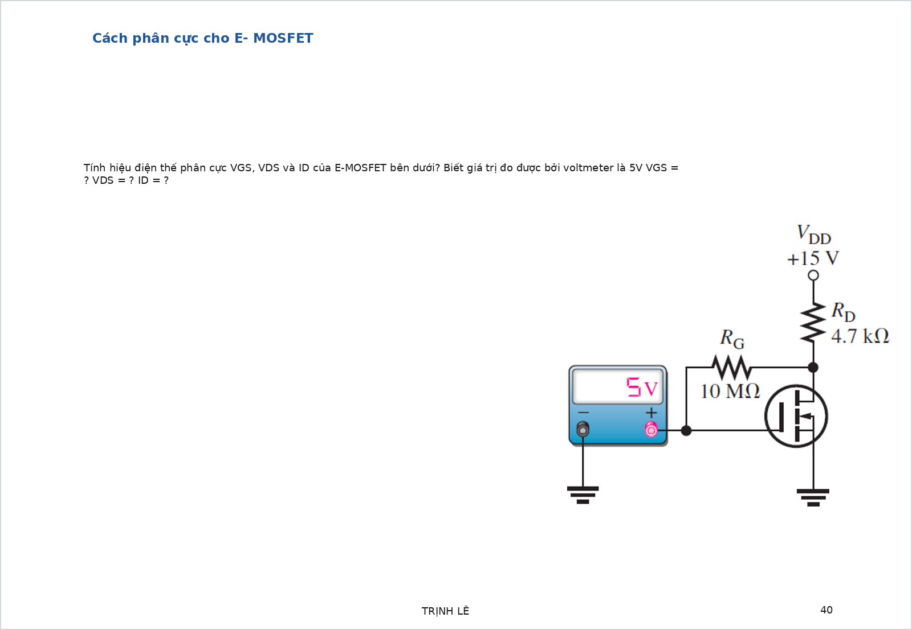

# Bài tập MOSFET có đáp án và lời giải chi tiết

Tài liệu này tập trung vào **E-MOSFET kênh N** theo đúng các bài trong slide.

Khi giải MOSFET, nên đi theo thứ tự:

1. Tìm $V_G$, $V_S$, từ đó suy ra $V_{GS}$.
2. Tính hằng số $K$ từ dữ kiện đặc tuyến nếu đề cho $I_D(\mathrm{on})$, $V_{GS}(\mathrm{on})$, $V_{TH}$.
3. Dùng:

$$
I_D=K(V_{GS}-V_{TH})^2
$$

4. Tính $V_{DS}$.
5. Kiểm tra điều kiện vùng bão hòa:

$$
V_{DS}\ge V_{GS}-V_{TH}
$$

## Bài 1. E-MOSFET phân cực 1

{ width=92% }

**Nguồn bài**: chọn từ [Giai_BT_Slide.md](/home/hiimfelix/Note/MĐT/bai_giai_slide/Giai_BT_Slide.md)

**Yêu cầu**

1. Tính hằng số $K$ của transistor.
2. Tính $V_G$, $V_{GS}$.
3. Tính $I_D$ và $V_{DS}$.
4. Kiểm tra MOSFET có đang ở vùng bão hòa hay không.

**Đáp số ngắn**

$$
K=\frac{I_D(\mathrm{on})}{(V_{GS}(\mathrm{on})-V_{TH})^2}
=\frac{0.2}{(4-2)^2}=0.05\,\mathrm{A/V^2}
$$

Sau đó:

$$
V_G=V_{DD}\frac{R_2}{R_1+R_2}
$$

Nếu source nối đất:

$$
V_{GS}=V_G
$$

$$
I_D=0.05(V_{GS}-2)^2
$$

$$
V_{DS}=V_{DD}-I_DR_D
$$

**Cơ sở và công thức**

Với E-MOSFET kênh N trong miền bão hòa:

$$
I_D=K(V_{GS}-V_{TH})^2
$$

Hằng số công nghệ:

$$
K=\frac{I_D(\mathrm{on})}{(V_{GS}(\mathrm{on})-V_{TH})^2}
$$

**Lời giải chi tiết**

Đề cho dữ kiện đặc tuyến:

$$
I_D(\mathrm{on})=200\,\mathrm{mA},\quad
V_{GS}(\mathrm{on})=4\,\mathrm{V},\quad
V_{TH}=2\,\mathrm{V}
$$

Từ đó:

$$
K=\frac{0.2}{(4-2)^2}=0.05\,\mathrm{A/V^2}
$$

Tiếp theo, vì gate gần như không hút dòng, điện áp gate được xác định bởi cầu chia áp:

$$
V_G=V_{DD}\frac{R_2}{R_1+R_2}
$$

Nếu source nối đất:

$$
V_{GS}=V_G
$$

Khi đã có $V_{GS}$, dòng drain được tính bằng:

$$
I_D=0.05(V_{GS}-2)^2
$$

Rồi:

$$
V_{DS}=V_{DD}-I_DR_D
$$

Cuối cùng phải kiểm tra:

$$
V_{DS}\ge V_{GS}-V_{TH}
$$

Nếu điều kiện này đúng thì phép tính theo công thức bình phương là hợp lệ.

---

## Bài 2. E-MOSFET phân cực 2

{ width=92% }

**Nguồn bài**: chọn từ [Giai_BT_Slide.md](/home/hiimfelix/Note/MĐT/bai_giai_slide/Giai_BT_Slide.md)

**Yêu cầu**

Giả sử voltmeter trong hình đo được `5 V`.

1. Suy ra $V_{GS}$.
2. Tính $I_D$.
3. Tính $V_{DS}$.
4. Kiểm tra điều kiện vùng bão hòa.

**Đáp số ngắn**

Nếu source nối đất:

$$
V_{GS}=5\,\mathrm{V}
$$

Dùng lại:

$$
K=\frac{I_D(\mathrm{on})}{(V_{GS}(\mathrm{on})-V_{TH})^2}
$$

thì:

$$
I_D=K(5-V_{TH})^2
$$

Nếu source nối đất:

$$
V_{DS}=V_{DD}-I_DR_D
$$

Nếu có điện trở source:

$$
V_{DS}=V_{DD}-I_D(R_D+R_S)
$$

**Cơ sở và công thức**

MOSFET dẫn khi:

$$
V_{GS}>V_{TH}
$$

Trong miền bão hòa:

$$
I_D=K(V_{GS}-V_{TH})^2
$$

Điều kiện kiểm tra:

$$
V_{DS}\ge V_{GS}-V_{TH}
$$

**Lời giải chi tiết**

Bài này thực chất là cùng một transistor với bài trước, nhưng đề cho trực tiếp điện áp điều khiển thay vì bắt ta tính từ chia áp.

Nếu voltmeter đo được `5 V` giữa gate và source, thì:

$$
V_{GS}=5\,\mathrm{V}
$$

Lấy hằng số $K$ đã suy ra từ dữ kiện transistor:

$$
K=\frac{I_D(\mathrm{on})}{(V_{GS}(\mathrm{on})-V_{TH})^2}
$$

ta tính được:

$$
I_D=K(5-V_{TH})^2
$$

Sau khi có $I_D$, điện áp $V_{DS}$ được suy ra bằng KVL ở nhánh drain-source. Nếu source nối thẳng mass thì:

$$
V_{DS}=V_{DD}-I_DR_D
$$

Nếu source có điện trở riêng thì phải trừ cả sụt áp trên $R_S$:

$$
V_{DS}=V_{DD}-I_D(R_D+R_S)
$$

Cuối cùng luôn luôn kiểm tra:

$$
V_{DS}\ge V_{GS}-V_{TH}
$$

Nếu sai, transistor đã rơi sang miền triode và không được tiếp tục dùng công thức bình phương bão hòa nữa.

