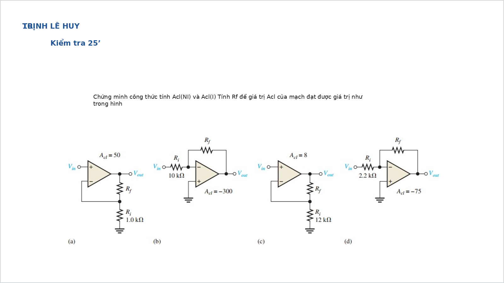
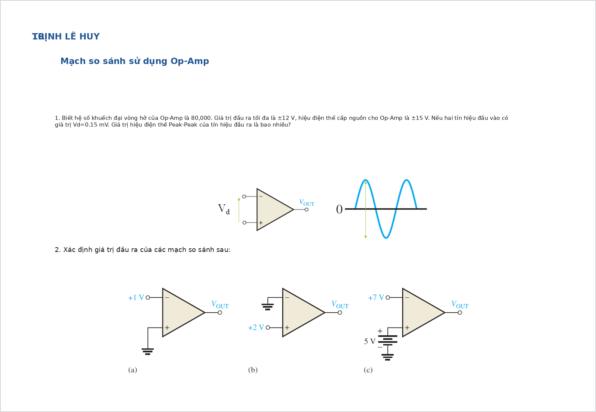
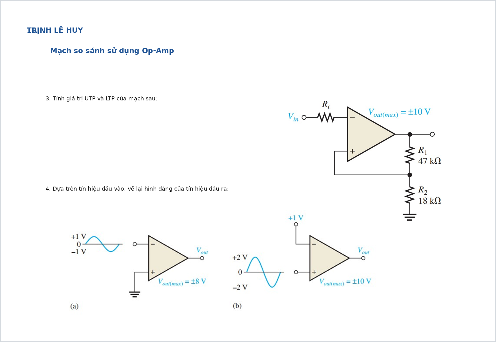
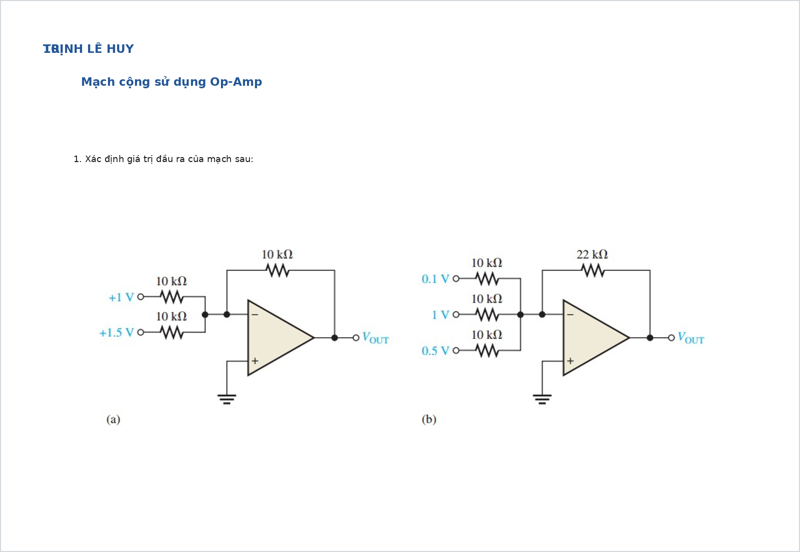
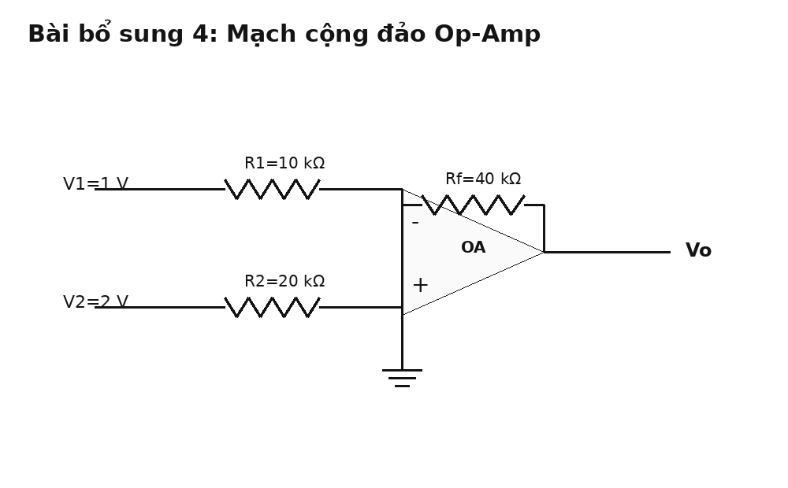
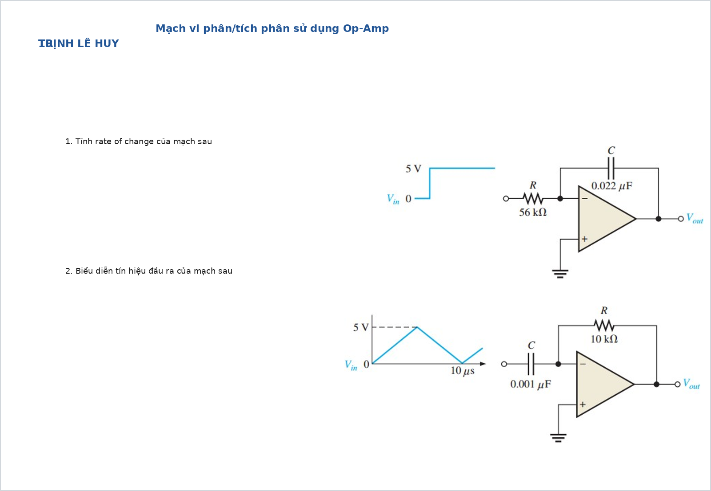
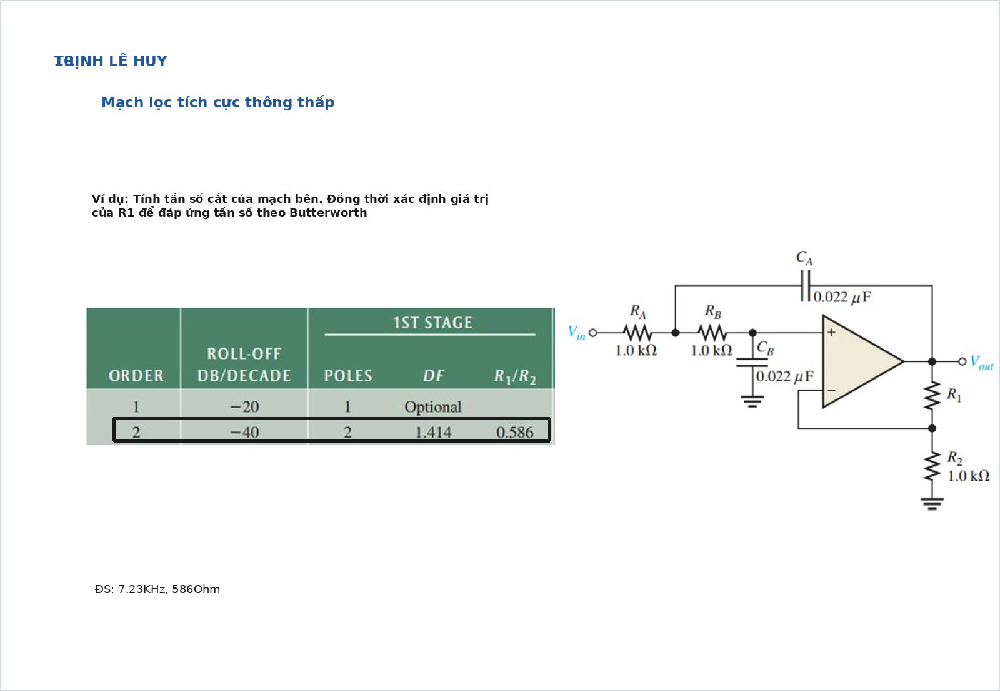
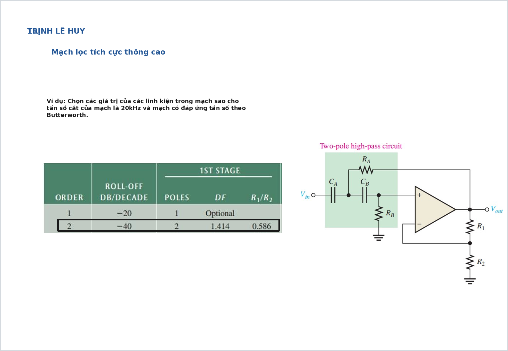

# Bài tập Op-Amp có đáp án và lời giải chi tiết

Tài liệu này chỉ tập trung vào **Op-Amp** và các mạch ứng dụng cơ bản. Mỗi bài đều có:

- hình mạch
- yêu cầu
- đáp số ngắn
- cơ sở công thức
- lời giải chi tiết

Khi làm bài Op-Amp, nên đi theo đúng thứ tự:

1. Xác định mạch đang làm việc ở vòng hở hay có hồi tiếp.
2. Nếu có hồi tiếp âm và op-amp lý tưởng, dùng `mass ảo` và `dòng vào bằng 0`.
3. Nếu là comparator hay Schmitt, không dùng công thức gain tuyến tính mà xét theo ngưỡng và bão hòa.
4. Nếu là lọc tích cực, tách riêng phần đặt `f_c`, `f_0`, `Q`, `A_v`.

## Bài 1. Chứng minh và áp dụng gain đảo, không đảo

{ width=92% }

**Nguồn bài**: chọn từ [Giai_BT_Slide.md](/home/hiimfelix/Note/MĐT/bai_giai_slide/Giai_BT_Slide.md)

**Yêu cầu**

1. Nhắc lại công thức độ lợi mạch không đảo và mạch đảo.
2. Tính $R_f$ cho từng mạch trong hình.

**Đáp số ngắn**

- Mạch không đảo:

$$
A_{cl(\mathrm{NI})}=1+\frac{R_f}{R_i}
$$

- Mạch đảo:

$$
A_{cl(\mathrm{I})}=-\frac{R_f}{R_i}
$$

Suy ra:

$$
R_f=(A_{cl}-1)R_i \quad \text{với mạch không đảo}
$$

$$
R_f=|A_{cl}|R_i \quad \text{với mạch đảo}
$$

Từ hình:

- (a) $R_f = 49\,\mathrm{k}\Omega$
- (b) $R_f = 3\,\mathrm{M}\Omega$
- (c) $R_f = 84\,\mathrm{k}\Omega$
- (d) $R_f = 165\,\mathrm{k}\Omega$

**Cơ sở và công thức**

Với op-amp lý tưởng có hồi tiếp âm:

$$
v_+ \approx v_-
$$

và:

$$
i_+ = i_- = 0
$$

Mạch không đảo:

$$
A_{cl}=1+\frac{R_f}{R_i}
$$

Mạch đảo:

$$
A_{cl}=-\frac{R_f}{R_i}
$$

**Lời giải chi tiết**

Mấu chốt của dạng bài này là phải nhận ra tín hiệu vào đang đi vào chân nào:

- vào chân `+` thì thường là mạch **không đảo**
- vào qua điện trở vào chân `-` thì là mạch **đảo**

Với mạch không đảo, vì:

$$
v_- = v_+ = v_{in}
$$

và mạng hồi tiếp là cầu chia áp:

$$
v_- = v_o\frac{R_i}{R_i+R_f}
$$

nên:

$$
v_{in} = v_o\frac{R_i}{R_i+R_f}
\Rightarrow
\frac{v_o}{v_{in}} = 1+\frac{R_f}{R_i}
$$

Với mạch đảo, nút vào chân `-` là mass ảo:

$$
v_- \approx 0
$$

Do dòng vào op-amp bằng 0 nên dòng qua $R_i$ bằng dòng qua $R_f$:

$$
\frac{v_{in}}{R_i} = -\frac{v_o}{R_f}
\Rightarrow
\frac{v_o}{v_{in}} = -\frac{R_f}{R_i}
$$

Áp dụng cho từng mạch:

- (a) không đảo, $A_{cl}=50$, $R_i=1\,\mathrm{k}\Omega$

$$
R_f=(50-1)\cdot1\,\mathrm{k}\Omega=49\,\mathrm{k}\Omega
$$

- (b) đảo, $A_{cl}=-300$, $R_i=10\,\mathrm{k}\Omega$

$$
R_f=300\cdot10\,\mathrm{k}\Omega=3\,\mathrm{M}\Omega
$$

- (c) không đảo, $A_{cl}=8$, $R_i=12\,\mathrm{k}\Omega$

$$
R_f=(8-1)\cdot12\,\mathrm{k}\Omega=84\,\mathrm{k}\Omega
$$

- (d) đảo, $A_{cl}=-75$, $R_i=2.2\,\mathrm{k}\Omega$

$$
R_f=75\cdot2.2\,\mathrm{k}\Omega=165\,\mathrm{k}\Omega
$$

---

## Bài 2. Comparator lý tưởng

{ width=92% }

**Nguồn bài**: chọn từ [Giai_BT_Slide.md](/home/hiimfelix/Note/MĐT/bai_giai_slide/Giai_BT_Slide.md)

**Yêu cầu**

1. Xác định đầu ra của comparator khi biết điện áp ở hai chân vào.
2. Phân biệt khi nào đầu ra về rail dương, khi nào về rail âm.

**Đáp số ngắn**

Comparator lý tưởng tuân theo quy tắc:

$$
v_o=
\begin{cases}
+V_{\mathrm{sat}}, & v_+>v_- \\
-V_{\mathrm{sat}}, & v_+<v_-
\end{cases}
$$

Nếu bài 1 cho:

$$
A_{OL}=80000,\quad v_d=0.15\,\mathrm{mV}
$$

thì:

$$
v_o=80000\cdot0.15\,\mathrm{mV}=12\,\mathrm{V}
$$

Nếu nguồn cấp là `±12 V` thì đầu ra chạm bão hòa dương.

**Cơ sở và công thức**

Comparator dùng op-amp nhưng không làm việc trong vùng tuyến tính hẹp như mạch khuếch đại đóng vòng. Khi đó:

$$
v_o \approx A_{OL}(v_+-v_-)
$$

Do $A_{OL}$ rất lớn nên chỉ cần dấu của $v_d$ là đủ quyết định đầu ra.

**Lời giải chi tiết**

Comparator thực chất trả lời câu hỏi:

- chân `+` đang cao hơn chân `-` hay không

Nếu cao hơn, đầu ra vọt về mức dương lớn nhất mà op-amp cho phép. Nếu thấp hơn, đầu ra rơi về mức âm lớn nhất.

Với bài cho cụ thể:

$$
v_o=80000\cdot0.15\,\mathrm{mV}=12\,\mathrm{V}
$$

Kết quả này bằng đúng rail dương nên mạch đã ở bão hòa dương.

Ở các hình còn lại, không cần nhân số nếu đề chỉ hỏi trạng thái. Chỉ cần so sánh:

- $v_+ > v_- \Rightarrow v_o = +V_{\mathrm{sat}}$
- $v_+ < v_- \Rightarrow v_o = -V_{\mathrm{sat}}$

Đây là dạng bài nền tảng để hiểu Schmitt trigger và các mạch tạo mức số.

---

## Bài 3. Schmitt trigger

{ width=92% }

**Nguồn bài**: chọn từ [Giai_BT_Slide.md](/home/hiimfelix/Note/MĐT/bai_giai_slide/Giai_BT_Slide.md)

**Yêu cầu**

1. Giải thích vì sao Schmitt trigger có hai ngưỡng.
2. Tính ngưỡng trên `UTP` và ngưỡng dưới `LTP`.
3. Mô tả cách đầu ra đổi trạng thái khi tín hiệu vào tăng giảm.

**Đáp số ngắn**

Với cấu hình đối xứng cơ bản:

$$
\beta = \frac{R_2}{R_1+R_2}
$$

$$
UTP = +\beta V_{\mathrm{sat}},\qquad
LTP = -\beta V_{\mathrm{sat}}
$$

**Cơ sở và công thức**

Schmitt trigger dùng **hồi tiếp dương**, nên điện áp tham chiếu ở một chân không cố định mà phụ thuộc đầu ra:

$$
v_{\mathrm{ref}}=\beta v_o
$$

Khi đầu ra đang ở `+V_sat`, ngưỡng so sánh là dương. Khi đầu ra đang ở `-V_sat`, ngưỡng so sánh là âm.

**Lời giải chi tiết**

Điểm khác nhau giữa comparator thường và Schmitt trigger là ở **hồi tiếp dương**.

Khi đầu ra đang ở mức dương:

$$
v_o=+V_{\mathrm{sat}}
$$

thì điện áp phản hồi tạo ra một ngưỡng dương:

$$
UTP = +\beta V_{\mathrm{sat}}
$$

Tín hiệu vào phải vượt ngưỡng này thì mạch mới lật trạng thái.

Khi đầu ra đã lật xuống mức âm:

$$
v_o=-V_{\mathrm{sat}}
$$

ngưỡng tham chiếu cũng đổi sang âm:

$$
LTP = -\beta V_{\mathrm{sat}}
$$

Tín hiệu vào muốn lật ngược lại thì phải giảm xuống dưới ngưỡng âm đó.

Ý nghĩa vật lý:

- mạch có **hysteresis**
- chống rung nhiễu tốt hơn comparator thường
- rất hợp để biến tín hiệu analog nhiễu thành xung vuông sạch

---

## Bài 4. Mạch cộng đảo

{ width=92% }

**Nguồn bài**: chọn từ [Giai_BT_Slide.md](/home/hiimfelix/Note/MĐT/bai_giai_slide/Giai_BT_Slide.md)

**Yêu cầu**

1. Tính $v_o$ cho từng mạch cộng trong hình.
2. Giải thích vì sao kết quả có dấu âm.

**Đáp số ngắn**

Với mạch (a):

$$
v_o = -R_f\left(\frac{v_1}{R_1}+\frac{v_2}{R_2}\right)
=-(1+1.5)=-2.5\,\mathrm{V}
$$

Với mạch (b):

$$
v_o=-22\,\mathrm{k}\Omega\left(\frac{0.1}{10\,\mathrm{k}\Omega}+\frac{1}{10\,\mathrm{k}\Omega}+\frac{0.5}{10\,\mathrm{k}\Omega}\right)
=-3.52\,\mathrm{V}
$$

**Cơ sở và công thức**

Với op-amp lý tưởng ở cấu hình cộng đảo:

$$
v_- \approx 0
$$

và:

$$
\sum i_{\mathrm{in}} = i_f
$$

nên:

$$
v_o=-R_f\left(\frac{v_1}{R_1}+\frac{v_2}{R_2}+\cdots\right)
$$

**Lời giải chi tiết**

Nút vào chân `-` là mass ảo nên điện áp tại đó gần bằng `0 V`. Dòng từ từng nguồn vào sẽ là:

$$
i_1=\frac{v_1}{R_1},\quad i_2=\frac{v_2}{R_2},\ \ldots
$$

Vì không có dòng đi vào op-amp, toàn bộ dòng đó phải chạy qua $R_f$:

$$
i_f=i_1+i_2+\cdots
$$

Mà:

$$
i_f=\frac{0-v_o}{R_f}=-\frac{v_o}{R_f}
$$

Do đó:

$$
v_o=-R_f\left(\frac{v_1}{R_1}+\frac{v_2}{R_2}+\cdots\right)
$$

Dấu âm xuất hiện vì đây là **mạch đảo**, tức đầu ra đổi pha `180^\circ` so với tổng tín hiệu vào.

---

## Bài 5. Mạch cộng đảo tự luyện

{ width=84% }

**Nguồn bài**: tự tạo thêm từ thư mục hiện tại

**Yêu cầu**

Tính điện áp ra $v_o$ của mạch cộng đảo.

**Đáp số ngắn**

$$
v_o=-R_f\left(\frac{v_1}{R_1}+\frac{v_2}{R_2}\right)
=-40\,\mathrm{k}\Omega\left(\frac{1}{10\,\mathrm{k}\Omega}+\frac{2}{20\,\mathrm{k}\Omega}\right)
=-8\,\mathrm{V}
$$

**Cơ sở và công thức**

Vẫn dùng công thức tổng quát:

$$
v_o=-R_f\sum \frac{v_i}{R_i}
$$

**Lời giải chi tiết**

Đây là dạng cộng đảo đơn giản nhưng rất tốt để luyện phản xạ.

Ta có:

$$
\frac{v_1}{R_1}=\frac{1}{10\,\mathrm{k}\Omega}
$$

$$
\frac{v_2}{R_2}=\frac{2}{20\,\mathrm{k}\Omega}
=\frac{1}{10\,\mathrm{k}\Omega}
$$

Hai nhánh đóng góp dòng bằng nhau, nên:

$$
\frac{v_1}{R_1}+\frac{v_2}{R_2}
=\frac{2}{10\,\mathrm{k}\Omega}
$$

Nhân với $R_f=40\,\mathrm{k}\Omega$:

$$
v_o=-40\,\mathrm{k}\Omega\cdot\frac{2}{10\,\mathrm{k}\Omega}
=-8\,\mathrm{V}
$$

Nếu nguồn cấp của op-amp nhỏ hơn `±8 V`, kết quả lý thuyết này sẽ không đạt được và đầu ra sẽ bão hòa. Đây là bước kiểm tra nên có ở cuối bài.

---

## Bài 6. Mạch vi phân và tích phân

{ width=92% }

**Nguồn bài**: chọn từ [Giai_BT_Slide.md](/home/hiimfelix/Note/MĐT/bai_giai_slide/Giai_BT_Slide.md)

**Yêu cầu**

1. Viết công thức đầu ra của mạch vi phân đảo.
2. Viết công thức đầu ra của mạch tích phân đảo.
3. Mô tả dạng đầu ra khi đầu vào là ramp hoặc xung vuông.

**Đáp số ngắn**

Mạch vi phân đảo:

$$
v_o=-R_fC\frac{dv_{in}}{dt}
$$

Mạch tích phân đảo:

$$
v_o(t)=-\frac{1}{RC}\int v_{in}(t)\,dt + v_o(0)
$$

**Cơ sở và công thức**

- Dòng qua tụ:

$$
i_C=C\frac{dv}{dt}
$$

- Ở nút mass ảo, dòng qua tụ bằng dòng qua điện trở hồi tiếp.

**Lời giải chi tiết**

Với mạch vi phân đảo, tín hiệu vào đi qua tụ nên dòng vào là:

$$
i_C=C\frac{dv_{in}}{dt}
$$

Toàn bộ dòng đó chạy qua $R_f$, nên:

$$
v_o=-R_f i_C=-R_fC\frac{dv_{in}}{dt}
$$

Ý nghĩa:

- đầu vào thay đổi càng nhanh thì đầu ra càng lớn
- ramp đi lên cho đầu ra âm hằng
- ramp đi xuống cho đầu ra dương hằng

Với mạch tích phân đảo, dòng qua điện trở vào là:

$$
i=\frac{v_{in}}{R}
$$

và dòng đó nạp cho tụ hồi tiếp:

$$
i=C\frac{d(-v_o)}{dt}
$$

Suy ra:

$$
\frac{dv_o}{dt}=-\frac{v_{in}}{RC}
$$

Lấy tích phân theo thời gian:

$$
v_o(t)=-\frac{1}{RC}\int v_{in}(t)\,dt + v_o(0)
$$

Nếu đầu vào là xung vuông, đầu ra là ramp hoặc tam giác. Đây là dạng rất hay gặp trong đề lý thuyết và bài nhận dạng dạng sóng.

---

## Bài 7. Lọc tích cực thông thấp

{ width=92% }

**Nguồn bài**: chọn từ [Giai_BT_Slide.md](/home/hiimfelix/Note/MĐT/bai_giai_slide/Giai_BT_Slide.md)

**Yêu cầu**

1. Tính tần số cắt của mạch lọc.
2. Tính độ lợi vòng kín cần có để được đáp ứng Butterworth.
3. Từ đó suy ra điện trở đặt gain.

**Đáp số ngắn**

Với linh kiện bằng nhau:

$$
f_c=\frac{1}{2\pi RC}
$$

Theo slide:

$$
f_c \approx 7.23\,\mathrm{kHz}
$$

Điều kiện Butterworth:

$$
A_v \approx 1.586
$$

Với mạch không đảo:

$$
A_v=1+\frac{R_2}{R_1}
$$

nên slide cho:

$$
R_1 \approx 586\,\Omega
$$

**Cơ sở và công thức**

Đối với Sallen-Key thông thấp bậc hai đối xứng:

$$
f_c=\frac{1}{2\pi RC}
$$

Để có đáp ứng Butterworth:

$$
Q=\frac{1}{\sqrt{2}}
$$

và trong cách viết của slide, điều này quy về:

$$
A_v \approx 1.586
$$

**Lời giải chi tiết**

Ở dạng bài này, có hai nhiệm vụ tách biệt:

1. đặt tần số cắt bằng bộ `R`, `C`
2. đặt dạng đáp ứng bằng độ lợi của op-amp

Phần tần số cắt:

$$
f_c=\frac{1}{2\pi RC}
$$

Chỉ cần thay trực tiếp các giá trị `R`, `C` trong hình là ra kết quả xấp xỉ `7.23 kHz`.

Phần thứ hai là điều kiện Butterworth. Mục tiêu của Butterworth là đáp ứng phẳng trong dải thông, nên hệ số damping hay hệ số chất lượng phải được chọn đúng. Trong cấu hình slide dùng, điều đó tương đương với:

$$
A_v \approx 1.586
$$

Vì op-amp ở đây mắc không đảo:

$$
A_v=1+\frac{R_2}{R_1}
$$

nên ta tính được điện trở hồi tiếp cần thiết.

Đây là cách giải điển hình cho các bài lọc tích cực: luôn tách riêng `f_c` và `A_v`.

---

## Bài 8. Lọc tích cực thông cao

{ width=92% }

**Nguồn bài**: chọn từ [Giai_BT_Slide.md](/home/hiimfelix/Note/MĐT/bai_giai_slide/Giai_BT_Slide.md)

**Yêu cầu**

1. Thiết kế điện trở hoặc tụ để đạt tần số cắt yêu cầu.
2. Đặt độ lợi để được đáp ứng Butterworth.

**Đáp số ngắn**

Với cấu hình thông cao bậc hai đối xứng:

$$
f_c=\frac{1}{2\pi RC}
$$

Nếu chọn:

$$
C=1\,\mathrm{nF},\quad f_c=20\,\mathrm{kHz}
$$

thì:

$$
R=\frac{1}{2\pi f_c C}
\approx 7.96\,\mathrm{k}\Omega
$$

Điều kiện Butterworth:

$$
A_v \approx 1.586
$$

nên:

$$
1+\frac{R_2}{R_1}=1.586
$$

Ví dụ chọn:

$$
R_1=10\,\mathrm{k}\Omega,\quad R_2=5.86\,\mathrm{k}\Omega
$$

**Cơ sở và công thức**

Giống bộ lọc thông thấp đối xứng, dạng thông cao Sallen-Key cũng có:

$$
f_c=\frac{1}{2\pi RC}
$$

và điều kiện Butterworth thường quy về chọn gain:

$$
A_v \approx 1.586
$$

**Lời giải chi tiết**

Với bài thiết kế lọc, nếu đề cho `f_c` trước thì ta thường chọn trước một linh kiện thuận tiện, sau đó tính linh kiện còn lại.

Ở đây chọn:

$$
C=1\,\mathrm{nF}
$$

thì:

$$
R=\frac{1}{2\pi\cdot20\,\mathrm{kHz}\cdot1\,\mathrm{nF}}
\approx 7.96\,\mathrm{k}\Omega
$$

Sau khi làm tròn theo dãy chuẩn có thể dùng `8.2 kΩ` hoặc giá trị gần tương đương.

Để đáp ứng đạt chuẩn Butterworth, phần op-amp không chỉ khuếch đại mà còn tạo hệ số damping đúng:

$$
A_v \approx 1.586
$$

Nếu mạch là không đảo:

$$
A_v=1+\frac{R_2}{R_1}
$$

thì chọn $R_1$ trước, rồi tính $R_2$.

Đây là dạng bài rất thường gặp khi đề yêu cầu `thiết kế bộ lọc từ tần số cắt`.
