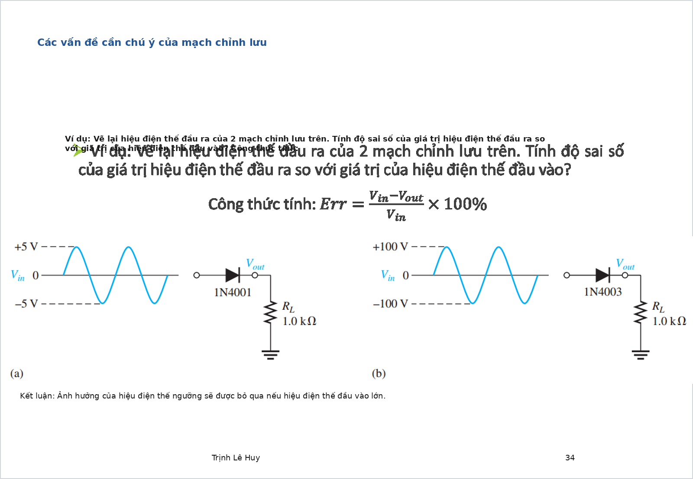
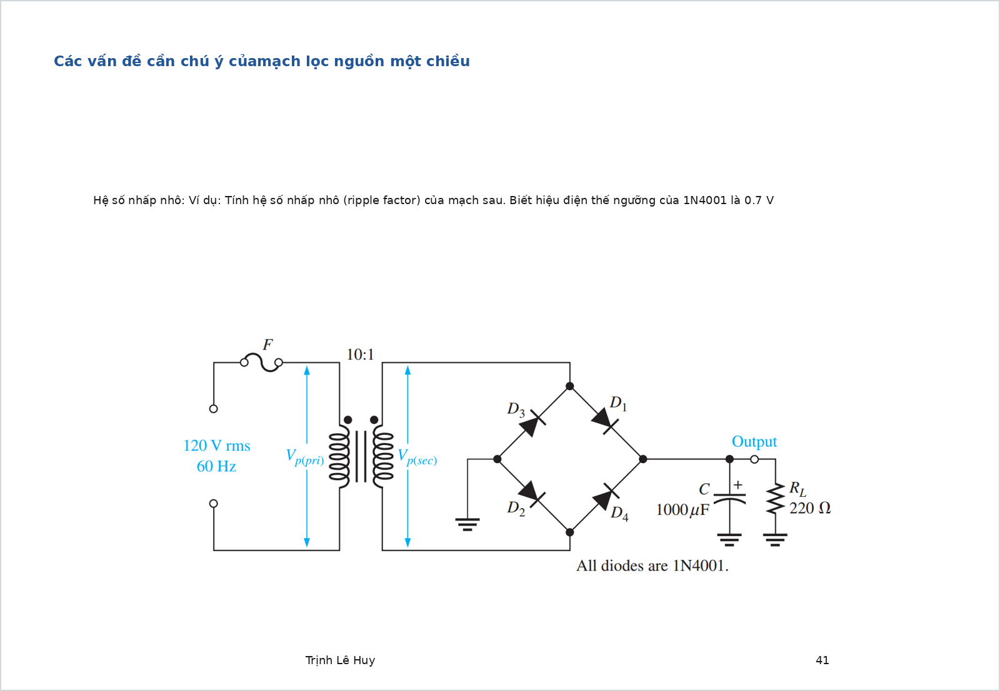
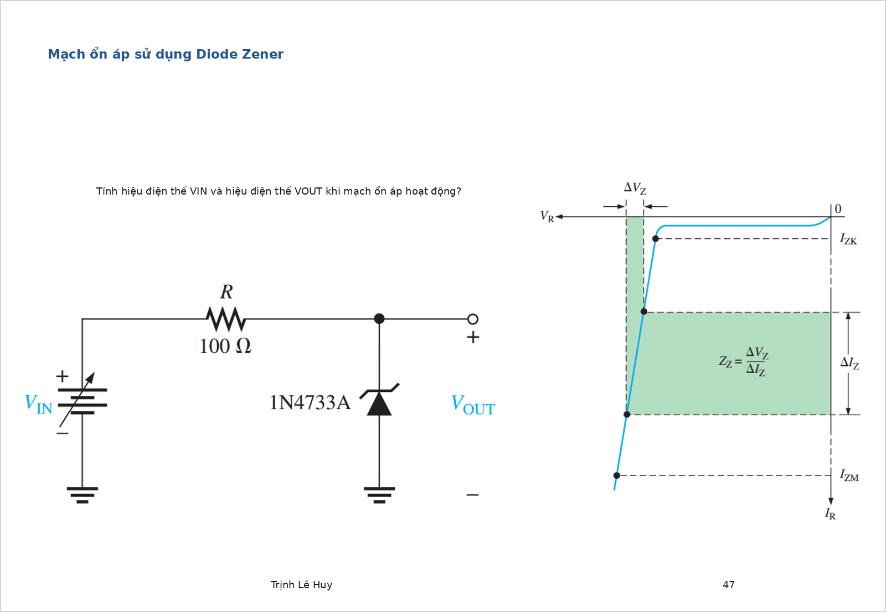
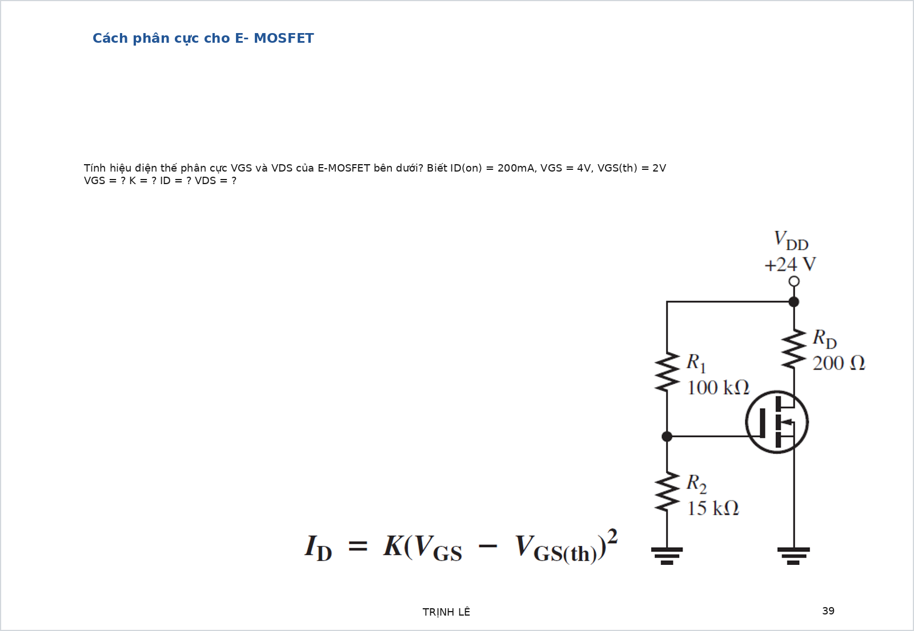
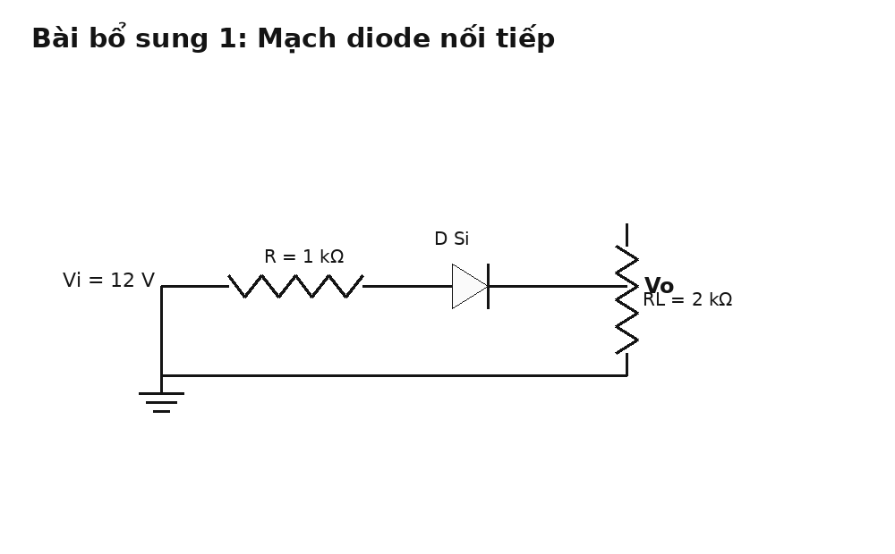

# Tự luận luyện tập có đáp án

Tài liệu này gồm:

- các bài chọn lọc từ những file bài giải đang có trong thư mục hiện tại
- các bài tự tạo thêm để luyện sâu hơn
- mỗi bài đều có hình, yêu cầu, đáp số, cơ sở làm bài và lời giải chi tiết ở cuối bài

Mục tiêu là để bạn có thể:

1. Nhìn hình mạch và tự phân tích trước.
2. Đối chiếu đáp số nhanh.
3. Đọc phần giải thích để hiểu vì sao làm như vậy.

# Phần A. Bài chọn từ thư mục hiện có

## Bài 1. Chỉnh lưu bán kỳ và toàn kỳ

{ width=92% }

**Nguồn bài**: chọn từ [Giai_BT_Slide.md](/home/hiimfelix/Note/MĐT/bai_giai_slide/Giai_BT_Slide.md)

**Yêu cầu**

1. Phân biệt dạng sóng ra của mạch chỉnh lưu bán kỳ và toàn kỳ.
2. Nếu dùng diode silicon thực với $V_D \approx 0.7\,\mathrm{V}$, hãy nêu điện áp đỉnh đầu ra gần đúng trong từng mạch.
3. So sánh sai số do sụt áp diode khi biên độ đầu vào thay đổi.

**Đáp số ngắn**

- Bán kỳ: chỉ giữ một bán kỳ thuận, $V_{p(out)} \approx V_{im} - V_D$.
- Toàn kỳ cầu: cả hai bán kỳ được lật lên dương, $V_{p(out)} \approx V_{im} - 2V_D$.
- Sai số tương đối tăng khi $V_{im}$ nhỏ.

**Cơ sở làm bài**

- Diode chỉ dẫn khi phân cực thuận.
- Chỉnh lưu bán kỳ: mỗi lần chỉ có 1 diode dẫn.
- Chỉnh lưu toàn kỳ cầu: mỗi nửa chu kỳ có 2 diode nối tiếp cùng dẫn.
- Sai số sụt áp diode:

$$
\varepsilon = \frac{nV_D}{V_{im}}\cdot 100\%
$$

trong đó $n=1$ với bán kỳ một diode, $n=2$ với cầu chỉnh lưu.

**Lời giải chi tiết**

Ở mạch bán kỳ, nửa chu kỳ thuận làm diode dẫn nên điện áp ra bám theo nửa dương của đầu vào. Nửa chu kỳ âm làm diode ngắt nên đầu ra gần bằng 0. Vì vậy:

$$
V_{p(out)} \approx V_{im} - V_D
$$

Ở mạch chỉnh lưu toàn kỳ kiểu cầu, dù đầu vào đang ở bán kỳ dương hay âm thì luôn có một cặp diode dẫn để đưa dòng qua tải theo cùng một chiều. Vì mỗi lần dòng đi qua hai diode nối tiếp nên:

$$
V_{p(out)} \approx V_{im} - 2V_D
$$

Khi $V_{im}$ lớn, ví dụ vài chục volt, sụt áp $0.7\,\mathrm{V}$ hoặc $1.4\,\mathrm{V}$ là tương đối nhỏ. Nhưng nếu $V_{im}$ chỉ vài volt thì sai số rất đáng kể, nên không thể bỏ qua mô hình thực của diode.

---

## Bài 2. Nhấp nhô nguồn DC có tụ lọc

{ width=92% }

**Nguồn bài**: chọn từ [Giai_BT_Slide.md](/home/hiimfelix/Note/MĐT/bai_giai_slide/Giai_BT_Slide.md)

**Yêu cầu**

1. Viết công thức gần đúng của điện áp nhấp nhô đỉnh-đỉnh.
2. Tính hệ số nhấp nhô nếu đã biết $I_L$, $C$, tần số lưới và điện áp DC.
3. Giải thích vì sao chỉnh lưu toàn kỳ lọc tốt hơn bán kỳ.

**Đáp số ngắn**

$$
V_{r(pp)} \approx \frac{I_L}{f_r C}
$$

$$
V_{r(rms)} = \frac{V_{r(pp)}}{2\sqrt{3}},\qquad
r = \frac{V_{r(rms)}}{V_{DC}}
$$

Với chỉnh lưu toàn kỳ:

$$
f_r = 2f_{\text{line}}
$$

**Cơ sở làm bài**

- Tụ được nạp gần đỉnh điện áp chỉnh lưu.
- Giữa hai lần nạp, tụ xả qua tải.
- Điện áp gợn nhỏ khi:
  - $C$ lớn hơn
  - $I_L$ nhỏ hơn
  - tần số nạp lại lớn hơn

**Lời giải chi tiết**

Trong mạch nguồn có tụ lọc, diode chỉ dẫn gần đỉnh sóng chỉnh lưu để nạp tụ. Sau đó điện áp nguồn giảm xuống thấp hơn điện áp trên tụ, diode ngắt và tụ bắt đầu xả qua tải. Chính quá trình xả này tạo ra độ gợn.

Nếu giả sử điện áp gợn nhỏ và gần tam giác, ta có công thức gần đúng:

$$
V_{r(pp)} \approx \frac{I_L}{f_r C}
$$

Với thành phần tam giác, giá trị hiệu dụng của phần gợn là:

$$
V_{r(rms)} = \frac{V_{r(pp)}}{2\sqrt{3}}
$$

Do đó hệ số nhấp nhô:

$$
r = \frac{V_{r(rms)}}{V_{DC}}
$$

Chỉnh lưu toàn kỳ tốt hơn bán kỳ vì tụ được nạp lại mỗi nửa chu kỳ, tức là:

$$
f_r = 2f_{\text{line}}
$$

Khi $f_r$ tăng gấp đôi, $V_{r(pp)}$ giảm còn khoảng một nửa nếu $I_L$ và $C$ giữ nguyên.

---

## Bài 3. Ổn áp Zener

{ width=92% }

**Nguồn bài**: chọn từ [Giai_BT_Slide.md](/home/hiimfelix/Note/MĐT/bai_giai_slide/Giai_BT_Slide.md)

**Yêu cầu**

1. Tính dòng qua điện trở hạn dòng.
2. Tính dòng tải và dòng Zener.
3. Kết luận mạch có còn ổn áp không.

**Đáp số ngắn**

$$
I_R = \frac{V_{IN} - V_Z}{R},\qquad
I_L = \frac{V_Z}{R_L},\qquad
I_Z = I_R - I_L
$$

Điều kiện đúng vùng ổn áp:

$$
I_{Z(min)} \le I_Z \le I_{Z(max)}
$$

và

$$
P_Z = V_Z I_Z \le P_{Z(max)}
$$

**Cơ sở làm bài**

- Zener làm việc ở vùng đánh thủng nghịch có kiểm soát.
- Khi đã vào vùng ổn áp, điện áp trên Zener gần như bằng hằng:

$$
V_{OUT} \approx V_Z
$$

- Dòng nút tại đầu ra:

$$
I_R = I_L + I_Z
$$

**Lời giải chi tiết**

Muốn biết Zener có ổn áp hay không, không được chỉ nhìn mỗi điện áp $V_Z$. Phải kiểm tra cả dòng.

Đầu tiên, từ nguồn và điện trở hạn dòng:

$$
I_R = \frac{V_{IN} - V_Z}{R}
$$

Nếu tải $R_L$ được nối song song với Zener thì:

$$
I_L = \frac{V_Z}{R_L}
$$

Do định luật nút:

$$
I_Z = I_R - I_L
$$

Sau đó kiểm tra:

$$
I_{Z(min)} \le I_Z \le I_{Z(max)}
$$

Nếu dòng quá nhỏ, Zener rời vùng ổn áp. Nếu dòng quá lớn, Zener quá công suất. Cuối cùng cần kiểm tra thêm công suất:

$$
P_Z = V_Z I_Z
$$

Nếu vượt giới hạn nhà sản xuất, mạch không an toàn dù điện áp tức thời có thể vẫn gần đúng bằng $V_Z$.

---

## Bài 4. Phân cực DC BJT kiểu CE

{ width=92% }

**Nguồn bài**: chọn từ [Giai_BT_Slide.md](/home/hiimfelix/Note/MĐT/bai_giai_slide/Giai_BT_Slide.md)

**Yêu cầu**

1. Tìm $I_B$, $I_C$, $I_E$.
2. Tìm $V_B$, $V_E$, $V_C$, $V_{CE}$.
3. Kết luận transistor đang ở vùng nào.

**Đáp số ngắn**

Quy trình chuẩn:

$$
I_B = \frac{V_{Th} - V_{BE}}{R_{Th} + (\beta+1)R_E}
$$

$$
I_C = \beta I_B,\qquad I_E = (\beta+1)I_B
$$

$$
V_E = I_E R_E,\quad V_C = V_{CC} - I_C R_C,\quad V_{CE} = V_C - V_E
$$

**Cơ sở làm bài**

- Ở phân tích DC: tụ ghép và tụ bypass được xem là hở mạch.
- Cầu chia áp base thường nên quy về Thevenin.
- Quan hệ dòng BJT vùng active:

$$
I_C = \beta I_B,\qquad I_E = I_B + I_C
$$

**Lời giải chi tiết**

Đây là bài phân cực DC kinh điển, nên thứ tự làm bài rất quan trọng:

1. Bỏ qua toàn bộ ảnh hưởng AC bằng cách xem tụ hở mạch.
2. Quy mạng phân áp base về nguồn Thevenin:

$$
V_{Th} = V_{CC}\frac{R_2}{R_1+R_2},\qquad
R_{Th} = R_1 \parallel R_2
$$

3. Viết KVL theo vòng base-emitter:

$$
I_B = \frac{V_{Th} - V_{BE}}{R_{Th} + (\beta+1)R_E}
$$

4. Từ đó suy ra:

$$
I_C = \beta I_B,\qquad I_E = (\beta+1)I_B
$$

5. Tính điện áp các cực:

$$
V_E = I_E R_E,\quad
V_B = V_E + 0.7,\quad
V_C = V_{CC} - I_C R_C
$$

6. Cuối cùng:

$$
V_{CE} = V_C - V_E
$$

Nếu $V_{CE}$ vẫn lớn hơn khoảng $0.2\,\mathrm{V}$ và $V_{BE}$ vào khoảng $0.7\,\mathrm{V}$ thì transistor còn trong vùng active. Nếu $V_{CE}$ quá nhỏ, cần cảnh giác mạch đã gần bão hòa.

---

## Bài 5. E-MOSFET phân cực

{ width=92% }

**Nguồn bài**: chọn từ [Giai_BT_Slide.md](/home/hiimfelix/Note/MĐT/bai_giai_slide/Giai_BT_Slide.md)

**Yêu cầu**

1. Tính hằng số $K$ của MOSFET từ dữ liệu đề.
2. Tính $I_D$ tại điểm phân cực.
3. Tính $V_{DS}$ và kiểm tra điều kiện bão hòa.

**Đáp số ngắn**

$$
K = \frac{I_{D(on)}}{(V_{GS(on)} - V_{GS(th)})^2}
$$

$$
I_D = K(V_{GS} - V_{TH})^2
$$

$$
V_{DS} = V_{DD} - I_D R_D
$$

Điều kiện bão hòa:

$$
V_{DS} \ge V_{GS} - V_{TH}
$$

**Cơ sở làm bài**

- E-MOSFET chỉ bắt đầu dẫn khi:

$$
V_{GS} > V_{TH}
$$

- Ở vùng bão hòa dùng mô hình bình phương ở trên.
- Gate gần như không hút dòng nên điện áp gate thường lấy bằng cầu chia áp.

**Lời giải chi tiết**

Đầu tiên, từ dữ kiện $I_{D(on)}$, $V_{GS(on)}$ và $V_{GS(th)}$, tính hằng số phần tử:

$$
K = \frac{I_{D(on)}}{(V_{GS(on)} - V_{GS(th)})^2}
$$

Nếu source nối đất, điện áp gate do cầu chia áp quyết định trực tiếp $V_{GS}$. Sau đó thay vào:

$$
I_D = K(V_{GS} - V_{TH})^2
$$

Khi có được $I_D$, viết phương trình vòng drain:

$$
V_{DS} = V_{DD} - I_D R_D
$$

Cuối cùng phải kiểm tra điều kiện vùng bão hòa:

$$
V_{DS} \ge V_{GS} - V_{TH}
$$

Nếu điều kiện này không đúng thì không được tiếp tục dùng công thức bão hòa nữa; khi đó MOSFET đã rơi sang vùng triode/ohmic.

---

## Bài 6. Điện trở hồi tiếp của mạch op-amp

{ width=92% }

**Nguồn bài**: chọn từ [Giai_BT_Slide.md](/home/hiimfelix/Note/MĐT/bai_giai_slide/Giai_BT_Slide.md)

**Yêu cầu**

1. Nhận dạng mạch là đảo hay không đảo.
2. Từ $A_{cl}$ và $R_i$, tính $R_f$.

**Đáp số ngắn**

- Mạch đảo:

$$
A_v = -\frac{R_f}{R_i}\Rightarrow R_f = |A_v|R_i
$$

- Mạch không đảo:

$$
A_v = 1+\frac{R_f}{R_i}\Rightarrow R_f = (A_v-1)R_i
$$

**Cơ sở làm bài**

- Dấu âm xuất hiện ở mạch đảo.
- Mạch không đảo luôn có độ lợi tối thiểu bằng 1.

**Lời giải chi tiết**

Đây là dạng bài rất dễ mất điểm nếu nhận nhầm cấu hình.

Nếu tín hiệu đi vào chân đảo qua $R_i$, chân không đảo nối mức chuẩn, và có điện trở từ đầu ra hồi tiếp về chân đảo thì đó là mạch đảo:

$$
A_v = -\frac{R_f}{R_i}
$$

Nếu tín hiệu đi vào chân không đảo, còn chân đảo nằm trong mạng hồi tiếp điện trở thì là mạch không đảo:

$$
A_v = 1+\frac{R_f}{R_i}
$$

Sau khi nhận dạng xong, chỉ việc biến đổi công thức để tìm $R_f$. Nhưng đừng quên:

- mạch đảo cho đầu ra ngược pha
- mạch không đảo cho đầu ra cùng pha

---

## Bài 7. Lọc tích cực thông thấp Sallen-Key

{ width=92% }

**Nguồn bài**: chọn từ [Giai_BT_Slide.md](/home/hiimfelix/Note/MĐT/bai_giai_slide/Giai_BT_Slide.md)

**Yêu cầu**

1. Tính tần số cắt $f_c$.
2. Tính độ lợi kín cần có để đạt đáp ứng Butterworth.

**Đáp số ngắn**

Với linh kiện bằng nhau:

$$
f_c = \frac{1}{2\pi RC}
$$

Butterworth bậc hai:

$$
A_v \approx 1.586
$$

và với op-amp không đảo:

$$
A_v = 1+\frac{R_2}{R_1}
$$

**Cơ sở làm bài**

- Mạch Sallen-Key thông thấp đối xứng có công thức tần số cắt rất gọn.
- Đáp ứng Butterworth là đáp ứng biên độ phẳng nhất trong dải thông.

**Lời giải chi tiết**

Khi hai điện trở bằng nhau và hai tụ bằng nhau, tần số cắt:

$$
f_c = \frac{1}{2\pi RC}
$$

Đây là thông số quyết định vị trí đồ thị bắt đầu suy giảm. Sau khi có $f_c$, nếu đề còn yêu cầu đáp ứng Butterworth thì ta phải điều chỉnh độ lợi vòng kín của op-amp.

Với Sallen-Key bậc hai kiểu chuẩn, Butterworth yêu cầu:

$$
A_v \approx 1.586
$$

Vì op-amp mắc kiểu không đảo nên:

$$
A_v = 1+\frac{R_2}{R_1}
$$

Từ đó có thể chọn cặp điện trở phù hợp. Đây là điểm nhiều bạn hay bỏ sót: $R$, $C$ không chỉ quyết định $f_c$, mà mạng hồi tiếp còn quyết định dạng đáp ứng.

# Phần B. Bài tự tạo có hình

## Bài 8. Mạch diode nối tiếp

{ width=82% }

**Yêu cầu**

Cho diode silicon với $V_D \approx 0.7\,\mathrm{V}$. Hãy tính:

1. Dòng mạch.
2. Điện áp ra trên tải $R_L$.

**Đáp số ngắn**

$$
I = \frac{12 - 0.7}{1\,\mathrm{k}\Omega + 2\,\mathrm{k}\Omega} \approx 3.77\,\mathrm{mA}
$$

$$
V_o = I R_L \approx 7.53\,\mathrm{V}
$$

**Cơ sở và công thức**

- Khi diode dẫn thuận, dùng mô hình sụt áp không đổi:

$$
V_D \approx 0.7\,\mathrm{V}
$$

- Vì các phần tử nằm nối tiếp nên cùng một dòng chạy qua toàn mạch.
- Áp dụng KVL:

$$
V_i = I R + V_D + I R_L
$$

**Lời giải chi tiết**

Kiểm tra nhanh: nguồn $12\,\mathrm{V}$ đủ lớn để diode dẫn, nên giả thiết diode ON là hợp lý.

Viết KVL:

$$
12 = I(1\,\mathrm{k}\Omega) + 0.7 + I(2\,\mathrm{k}\Omega)
$$

$$
11.3 = 3\,\mathrm{k}\Omega \cdot I
$$

$$
I \approx 3.77\,\mathrm{mA}
$$

Điện áp trên tải:

$$
V_o = I R_L = 3.77\,\mathrm{mA}\cdot 2\,\mathrm{k}\Omega \approx 7.53\,\mathrm{V}
$$

---

## Bài 9. BJT CE tự phân cực bằng cầu chia áp

{ width=82% }

**Yêu cầu**

Biết $\beta = 100$, $V_{BE} = 0.7\,\mathrm{V}$. Hãy tìm:

1. $I_B$, $I_C$, $I_E$
2. $V_E$, $V_C$, $V_{CE}$
3. Kết luận vùng hoạt động

**Đáp số ngắn**

$$
V_{Th} = 12\cdot \frac{10}{47+10} \approx 2.105\,\mathrm{V}
$$

$$
R_{Th} = 47\,\mathrm{k}\Omega \parallel 10\,\mathrm{k}\Omega \approx 8.25\,\mathrm{k}\Omega
$$

$$
I_B \approx \frac{2.105-0.7}{8.25\,\mathrm{k}\Omega + 101\cdot680\,\Omega}
\approx 18.3\,\mu\mathrm{A}
$$

$$
I_C \approx 1.83\,\mathrm{mA},\quad
I_E \approx 1.85\,\mathrm{mA}
$$

$$
V_E \approx 1.26\,\mathrm{V},\quad
V_C \approx 7.97\,\mathrm{V},\quad
V_{CE} \approx 6.71\,\mathrm{V}
$$

**Cơ sở và công thức**

- Quy về Thevenin ở base.
- Dùng KVL vòng base-emitter:

$$
I_B = \frac{V_{Th} - V_{BE}}{R_{Th} + (\beta+1)R_E}
$$

- Sau đó:

$$
I_C = \beta I_B,\qquad I_E = (\beta+1)I_B
$$

**Lời giải chi tiết**

Từ cầu chia áp:

$$
V_{Th} = V_{CC}\frac{R_2}{R_1+R_2}
$$

$$
R_{Th} = R_1 \parallel R_2
$$

Sau đó:

$$
I_B = \frac{V_{Th} - 0.7}{R_{Th} + (\beta+1)R_E}
$$

Từ $I_B$ tính:

$$
I_C = \beta I_B,\qquad I_E = (\beta+1)I_B
$$

Điện áp emitter:

$$
V_E = I_E R_E
$$

Điện áp collector:

$$
V_C = V_{CC} - I_C R_C
$$

Do đó:

$$
V_{CE} = V_C - V_E
$$

Vì $V_{CE}$ còn khá lớn so với $0.2\,\mathrm{V}$ nên transistor đang ở vùng active, thích hợp để khuếch đại.

---

## Bài 10. JFET tự phân cực

{ width=82% }

**Yêu cầu**

Với $I_{DSS}=8\,\mathrm{mA}$, $V_P=-4\,\mathrm{V}$, hãy tìm:

1. $I_D$
2. $V_{GS}$
3. $V_{DS}$

**Đáp số ngắn**

Do $V_G \approx 0$:

$$
V_{GS} = -I_D R_S
$$

với $R_S = 1\,\mathrm{k}\Omega$, viết theo đơn vị mA thì:

$$
V_{GS} = -I_D \;(\mathrm{V})
$$

Shockley:

$$
I_D = 8\left(1-\frac{V_{GS}}{-4}\right)^2
$$

Giải gần đúng được:

$$
I_D \approx 2.89\,\mathrm{mA},\quad
V_{GS} \approx -2.89\,\mathrm{V}
$$

$$
V_D = 15 - I_D R_D \approx 8.64\,\mathrm{V}
$$

$$
V_{DS} = V_D - V_S \approx 5.75\,\mathrm{V}
$$

**Cơ sở và công thức**

- Tự phân cực JFET:

$$
V_G \approx 0,\qquad V_S = I_D R_S,\qquad V_{GS} = -I_D R_S
$$

- Phương trình Shockley:

$$
I_D = I_{DSS}\left(1-\frac{V_{GS}}{V_P}\right)^2
$$

**Lời giải chi tiết**

Vì gate hầu như không hút dòng và được nối về mass qua điện trở lớn, ta lấy gần đúng:

$$
V_G \approx 0
$$

Source có điện áp:

$$
V_S = I_D R_S
$$

nên:

$$
V_{GS} = V_G - V_S = -I_D R_S
$$

Thay vào Shockley:

$$
I_D = 8\left(1-\frac{-I_D}{-4}\right)^2
$$

Giải gần đúng được $I_D \approx 2.89\,\mathrm{mA}$. Từ đó:

$$
V_S \approx 2.89\,\mathrm{V},\qquad V_{GS}\approx -2.89\,\mathrm{V}
$$

Điện áp drain:

$$
V_D = 15 - I_D R_D
$$

và:

$$
V_{DS} = V_D - V_S
$$

Nếu $V_{DS}$ vẫn đủ lớn, JFET còn trong vùng thích hợp để khuếch đại.

---

## Bài 11. Mạch cộng đảo dùng Op-Amp

{ width=82% }

**Yêu cầu**

Cho $V_1 = 1\,\mathrm{V}$, $V_2 = 2\,\mathrm{V}$, $R_1=10\,\mathrm{k}\Omega$, $R_2=20\,\mathrm{k}\Omega$, $R_f=40\,\mathrm{k}\Omega$. Tính $V_o$.

**Đáp số ngắn**

$$
V_o = -R_f\left(\frac{V_1}{R_1} + \frac{V_2}{R_2}\right)
$$

$$
V_o = -40\,\mathrm{k}\Omega
\left(\frac{1}{10\,\mathrm{k}\Omega} + \frac{2}{20\,\mathrm{k}\Omega}\right)
= -8\,\mathrm{V}
$$

**Cơ sở và công thức**

- Với op-amp lý tưởng có hồi tiếp âm:

$$
I_+ = I_- = 0,\qquad V_+ \approx V_-
$$

- Nút vào đảo là mass ảo.
- Viết KCL tại nút vào đảo.

**Lời giải chi tiết**

Vì đầu không đảo nối mass nên:

$$
V_+ = 0 \Rightarrow V_- \approx 0
$$

Do dòng vào op-amp bằng 0, tổng dòng từ các nguồn vào qua điện trở phải chảy qua $R_f$:

$$
\frac{V_1}{R_1} + \frac{V_2}{R_2} = \frac{-V_o}{R_f}
$$

Suy ra:

$$
V_o = -R_f\left(\frac{V_1}{R_1} + \frac{V_2}{R_2}\right)
$$

Thay số:

$$
V_o = -8\,\mathrm{V}
$$

Dấu âm cho biết đầu ra đảo pha so với tổng có trọng số của các đầu vào.

---

## Bài 12. Mạch RC thông cao bậc một

{ width=82% }

**Yêu cầu**

1. Xác định loại mạch lọc.
2. Tính tần số cắt.
3. Giải thích vì sao ở tần số thấp tín hiệu ra nhỏ.

**Đáp số ngắn**

Đây là mạch thông cao RC bậc một.

$$
f_c = \frac{1}{2\pi RC}
= \frac{1}{2\pi \cdot 3.3\,\mathrm{k}\Omega \cdot 10\,\mathrm{nF}}
\approx 4.82\,\mathrm{kHz}
$$

**Cơ sở và công thức**

- Dung kháng tụ:

$$
X_C = \frac{1}{2\pi f C}
$$

- Tần số cắt của mạch RC bậc một:

$$
f_c = \frac{1}{2\pi RC}
$$

**Lời giải chi tiết**

Quan sát mạch: tụ mắc nối tiếp ngõ vào, tải lấy trên điện trở xuống mass. Đó là cấu trúc kinh điển của lọc thông cao.

Ở tần số thấp:

- $f$ nhỏ
- nên $X_C$ lớn
- tụ cản trở tín hiệu đi qua

Do đó điện áp ra trên tải nhỏ.

Ở tần số cao:

- $f$ tăng
- $X_C$ giảm
- tụ cho tín hiệu đi qua tốt hơn

Tần số cắt được tính bằng:

$$
f_c = \frac{1}{2\pi RC}
$$

Thay số:

$$
f_c \approx 4.82\,\mathrm{kHz}
$$

---

# Gợi ý cách dùng tài liệu này

1. Che phần “Đáp số ngắn” và “Lời giải chi tiết” trước khi làm.
2. Tự viết ra:
   - mô hình linh kiện
   - công thức nền
   - các bước biến đổi
3. Chỉ mở đáp án sau khi đã tự tính xong.
4. Nếu sai, đối chiếu lại phần “Cơ sở và công thức” trước, rồi mới đọc lời giải chi tiết.

